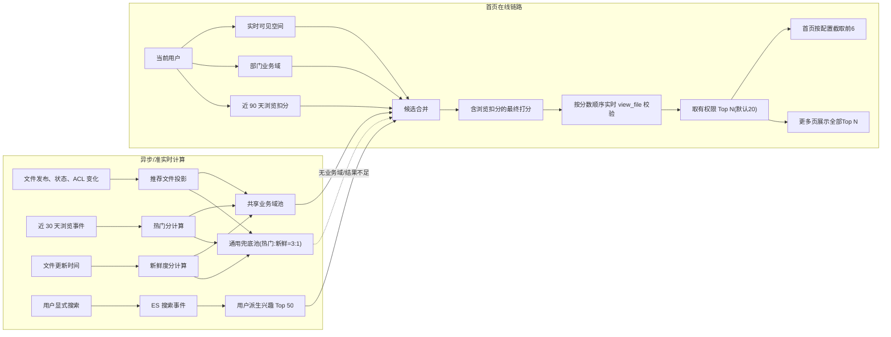
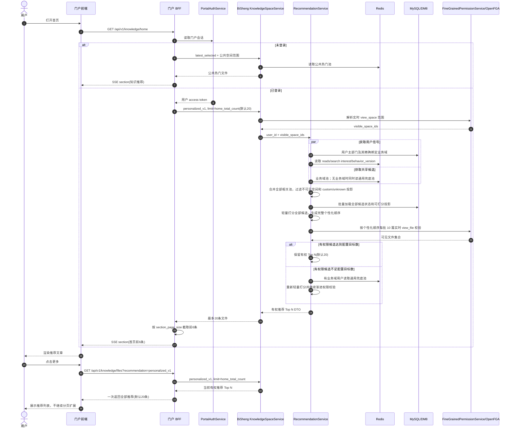

# 首页个性化推荐技术方案

> 日期：2026-07-14
> 最后更新：2026-07-16
> 状态：核心实现与定向验证完成；待集成环境性能、E2E 与 DM8 实库门禁
> 代码主战场：`bisheng_2` 后端；`shougang-group-knowledge-portal` 前后端少量改造
> 本方案只改造首页内置“知识推荐”区块，行业情报等标签区块维持现状。

---

## 1. 结论

首页推荐采用“共享候选池 + 用户轻量行为信号 + 请求时最终权限校验”的架构：

1. 未登录用户继续按现有公共热门规则推荐。
2. 已登录用户只根据主部门精确绑定的业务域、近 90 天搜索兴趣、近 90 天浏览记录、近 30 天热度和内容新鲜度生成推荐；兼职/次要部门及父子部门绑定均不参与继承。
3. 不为每个用户维护完整的权限候选池。
4. 共享候选池优先只收录“没有文件/文件夹级权限覆盖、可继承空间权限”的文件，降低权限过滤后无内容的概率。
5. “继承权限”投影仅用于候选优化，不能作为跳过鉴权的依据；最终返回前必须使用当前用户实时执行 `view_file` 校验。
6. 独立 ACL 文件第一期不进入首页共享候选池，仍可通过搜索、空间浏览等现有入口访问。
7. 个性化服务默认保留有权 Top 20；无法找到配置目标数时返回实际数量，绝不绕过权限补足。
8. 业务域池不按知识空间限额，在整个业务域内按热门:新鲜 = 3:1 取值。
9. 热门分使用来源降权、默认 7 天的可配置半衰期和 14+3 天轮换，避免首页推荐流量把同一文件永久固化在热门池。
10. 搜索兴趣池是每个活跃用户独立的 Top 50，不同用户不共享兴趣候选排序。
11. 删除 30/20/10 硬配额：所有相关池先参与轻量个性化打分，再按排序渐进执行完整文件权限校验；200 是权限检查熔断上限，不是候选召回规则。
12. 常规个性化链路只使用业务域池和用户兴趣池；全局热门/新鲜合并为一个通用兜底池，只在无业务域、候选过少或结果不足时使用。
13. 首页仍复用现有 `display.home.section_page_size` 配置，默认只展示 Top 6；点击“更多”进入推荐列表页，一次展示本次有权推荐 Top 20。推荐总数新增 `recommendation.home_total_count` 配置，默认 20。
14. 部门与业务域复用现有业务域编辑界面维护，`domains[].department_ids` 是唯一配置源；同一部门可在多个业务域中被选中，但父子部门不级联、不继承。热度半衰期、首页推荐来源权重、稳定打散分差阈值和变化周期均可配置。

---

## 2. 背景与目标

### 2.1 目标

- 已登录用户优先看到与所属部门业务域相关的知识。
- 结合近期搜索行为，提升用户正在关注内容的排序。
- 已浏览文章不直接排除，按最近浏览时间扣分，使未读和较久未浏览内容通常排得更靠前。
- 未登录用户仍有稳定的公共热门内容。
- 已登录用户首页只展示推荐结果前若干条，点击“更多”可查看当前全部个性化推荐结果。
- 不改变现有 OpenFGA/ReBAC 权限语义，不泄露无权文件标题、摘要、标签等信息。
- 首页推荐区块 P95 小于 800 ms，首页首个 SSE 区块 P95 小于 1 s。

### 2.2 非目标

- 第一阶段不做协同过滤、“看过此文的人还看过”等用户相似度算法。
- 第一阶段不推荐带文件/文件夹独立 ACL 的内容。
- 不为每个注册用户提前生成一套完整候选池。
- 不使用 BiSheng 系统角色代替部门或业务域。
- 不改变行业情报等标签区块的数据来源和排序规则。

---

## 3. 已确认业务规则

### 3.1 用户业务域来源

业务域由用户主部门的精确绑定配置决定：

```text
用户 → 主部门 → 该部门直接绑定的一个或多个业务域
```

已确认规则：

- 只读取 `user_department.is_primary=true` 的主部门，不读取兼职或其他次要部门。
- 一个部门可直接绑定多个业务域；用户业务域等于主部门直接绑定的业务域集合，按业务域编码去重。
- 部门绑定只精确作用于当前部门，不向子部门继承，也不从父部门继承；父部门和子部门需要分别配置。
- 用户没有主部门、主部门没有绑定业务域，或主部门数据异常时，业务域特征不参与本次加权，而不是按 0 分处理；不得回退读取次要部门。

### 3.2 业务域只影响推荐，不授予权限

必须保持以下不变量：

```text
部门绑定业务域 ≠ 用户获得该业务域文件权限
业务域匹配 ≠ view_space
业务域匹配 ≠ view_file
```

业务域配置不得写 OpenFGA tuple，也不得扩大 `visible_space_ids`。

### 3.3 浏览处理

已读文章与未读文章进入同一批候选集，不做前置排除或二次回补。根据用户对该文件最近一次浏览时间计算 `read_penalty`：

| 最近一次浏览时间 | `read_penalty` |
|---|---|
| 0～7 天 | -80 |
| 8～30 天 | -50 |
| 31～90 天 | -30 |
| 90 天以前或从未浏览 | 0 |

边界规则：

- 同一文件多次浏览只取最近一次。
- 浏览扣分直接加到 0～100 的基础分上，不参与权重归一化。
- 近 7 天已读内容仍可推荐；当其业务域、搜索兴趣、热度和新鲜度足够高时，总分仍可进入有权 Top 20，并可能进入首页展示的前 6。

### 3.4 推荐结果数量

推荐计算数量和首页展示数量分开配置：

| 配置 | 现状/默认值 | 语义 |
|---|---:|---|
| `display.home.section_page_size` | 现有配置，默认 6 | 首页“知识推荐”区块展示条数 |
| `recommendation.home_total_count` | 新增配置，默认 20 | 权限过滤后保留的推荐总数，也是“更多”页最多展示条数 |

约束：

- `1 <= display.home.section_page_size <= recommendation.home_total_count <= 50`。
- 首页生成完整有权推荐 Top N，再由门户 BFF 截取前 `section_page_size` 条写入首页 SSE；前端不重新打分。
- 点击“更多”后按 `personalized_v1` 获取并一次展示全部 Top N，不继续扩展成无限推荐流。
- 权限或候选不足 N 条时，“更多”页展示实际数量；首页展示 `min(section_page_size, 实际数量)` 条。

### 3.5 可配置推荐参数

除推荐数量外，以下算法参数也纳入配置，不在代码中写死：

| 配置 | 默认值 | 约束 | 语义 |
|---|---:|---:|---|
| `recommendation.hot_half_life_days` | 7 | 1～90 天 | 浏览热度的半衰期 |
| `recommendation.home_entry_source_weight` | 0.3 | 0～1 | 首页推荐入口浏览相对自然入口的热度权重 |
| `recommendation.stable_shuffle_score_gap` | 5 | 0～100 分 | 允许稳定打散的最大候选分差；0 表示仅同分打散 |
| `recommendation.stable_shuffle_cycle_days` | 7 | 1～30 天 | 稳定打散结果的变化周期 |

配置由管理后台的推荐配置区域维护并同步到 BiSheng；保存后递增推荐配置版本，使短期推荐缓存失效。稳定打散参数可随新版本立即生效；热度半衰期或来源权重变化时，BiSheng 先用新版本异步重算热门路和共享池，完成后再原子切换生效版本，重算期间继续使用上一有效版本。非法值必须拒绝保存，不得静默回退。

---

## 4. 现状架构与约束

### 4.1 门户首页

- 门户首页通过 `GET /api/v1/knowledge/home` 返回 SSE。
- 未登录时使用系统客户端，仅访问公共空间。
- 已确认公共空间对所有门户用户可见；公共空间内满足正常文件条件的内容可继续复用现有公共热门链路，不额外增加逐文件权限校验。custom ACL、异常状态或不可推荐文件仍不得进入公共热门结果。
- 已登录时使用用户 token，先解析用户可见空间，再请求 BiSheng。
- 当前第一个内置区块使用 `latest_selected` 推荐模式，按门户浏览热度排序。
- 当前首页区块条数已由 `display.home.section_page_size` 控制，Schema 和默认配置均为 6，`KnowledgeService.home_content()` 已使用该值请求区块数据；本方案直接复用，不新增重复的首页展示数量配置。
- 当前内置推荐“更多”链接固定为 `recommendation=latest_selected`，列表页也只识别该模式；个性化上线时需同时扩展 `HomePage.tsx` 和 `ListPage.tsx` 对 `personalized_v1` 的跳转与取数。
- 当前登录用户首页按“账号 + 可见空间 + 门户配置”缓存 1800 秒，但缓存键不包含搜索、浏览行为版本。

因此个性化上线后，登录用户不能继续使用现有完整首页缓存，否则用户浏览文章后最多半小时无法应用新的浏览扣分。

### 4.2 BiSheng 权限模型

现有文件可见性不是一次简单的 OpenFGA `check`：

- 先计算空间成员权限和公共空间权限。
- 再结合文件/文件夹 lineage、relation model、部门路径、用户组、显式 tuple 和最近绑定覆盖规则。
- 没有命中子级覆盖时，才叠加空间成员权限。
- 文件级检查异常时应失败关闭，不能把异常文件当成可见。

因此：

- OpenFGA `batch_check` 不能直接替换现有完整可见性引擎。
- 普通 TTL 缓存不能作为跳过文件级权限校验的依据。
- 候选池中的“继承权限”状态只用于减少无权候选，最终 Top N 仍需实时复核。

---

## 5. 总体架构



职责边界：

| 组件 | 职责 |
|---|---|
| 门户前端 | 继续消费 SSE；显式搜索时上报搜索事件 |
| 门户 BFF | 维持登录态和 SSE 编排；登录用户选择 `personalized_v1`；不做重计算 |
| BiSheng Recommendation Service | 用户业务域、行为信号、候选合并、打分、降级 |
| BiSheng Permission Service | `view_space`、`view_file` 最终权威判断 |
| Redis | 业务域/通用兜底候选、用户浏览状态、派生兴趣 Top 50、行为版本和短期结果；不存原始搜索历史 |
| MySQL/DM8 | 既有聚合门户配置（含 `domains[].department_ids`）、推荐文件投影、现有文件/空间业务域数据 |
| Elasticsearch | 搜索兴趣召回、浏览热度离线聚合、长期行为审计 |
| Celery | 6 小时热度/池重排、用户兴趣异步重算、事件增量投影和分层对账 |

---

## 6. 数据模型

### 6.1 部门与业务域配置

复用门户现有 `DomainConfig` 和业务域编辑界面，不新增映射表、顶层映射字段或独立管理接口。`portal.domains[].department_ids` 是部门与业务域关系的唯一配置源：

| 字段 | 类型 | 说明 |
|---|---|---|
| `domains[].code` | string | 业务域编码，保存时规范化为大写 |
| `domains[].enabled` | boolean | 只有启用且编码有效的业务域参与推荐映射 |
| `domains[].department_ids` | int[] | 精确选中的部门 ID，正整数、去重，不展开父子部门 |

示例：

```json
{
  "domains": [
    {
      "name": "生产",
      "code": "PP",
      "enabled": true,
      "space_ids": [1001],
      "department_ids": [10, 11]
    },
    {
      "name": "安全",
      "code": "SAFE",
      "enabled": true,
      "space_ids": [1002],
      "department_ids": [10]
    }
  ]
}
```

上例中部门 `10` 同时关联 `PP` 和 `SAFE`。该多业务域语义由同一部门 ID 出现在多个业务域配置中表达，不再维护反向的第二份结构。

页面和保存规则：

- 在现有业务域新增/编辑弹窗中复用部门树多选控件。
- 父部门、子部门独立勾选；半选状态只用于界面提示，不表示级联选择或继承。
- 清空某业务域的 `department_ids` 即删除该业务域的全部部门关系。
- 门户保存完整 `domains` 后，通过既有聚合配置 PUT 一次同步到 BiSheng，不拆分第二个保存请求。
- BiSheng 按当前租户聚合配置动态派生 `department_id -> business_domain_codes` 映射；用户解析只查唯一主部门的精确 ID，不读次要部门，不遍历父部门或子部门。

### 6.2 文件业务域数据源

现有结构已支持：

- `knowledge.business_domain_codes`：知识空间允许的业务域编码列表，已有 `v2_6_0_f050_knowledge_business_domain_codes.py` 迁移。
- 文件业务域：现有逻辑从 `split_rule` 或文件编码中解析 `business_domain_code`。

第一期不再给 `knowledge_file` 增加重复源字段，避免文件编码、`split_rule` 和新列出现三份数据不一致。候选池离线刷新时使用现有解析逻辑，将规范化后的编码一次性写入推荐投影表。在线请求只查投影或 Redis，不做前导 `%` 的 `LIKE`、不扫全部文件。

如果后续其他高频场景也需要直接按文件业务域查询，再单独评审是否将该字段规范化到 `knowledge_file`；不作为本期依赖。

### 6.3 推荐文件投影

新增表 `portal_recommendation_file_projection`：

| 字段 | 类型 | 说明 |
|---|---|---|
| `id` | bigint PK | 主键 |
| `tenant_id` | int | 租户 |
| `file_id` | int | 文件 ID，租户内唯一 |
| `space_id` | int | 所属知识空间 |
| `business_domain_code` | varchar(16) nullable | 文件业务域 |
| `permission_scope` | varchar(16) | `inherited/custom/unknown` |
| `recommendable` | smallint | 是否允许进入共享推荐池 |
| `reason_code` | varchar(32) | 不可推荐原因，便于排障 |
| `source_update_time` | datetime | 文件更新时间快照 |
| `projection_version` | bigint | 投影版本 |
| `create_time/update_time` | datetime | 时间戳 |

推荐资格：

```text
status = SUCCESS
file_type = FILE
当前主版本
未删除、未违规、未隐藏
permission_scope = inherited
```

`business_domain_code` 有效是进入“业务域池”的额外条件。未归类文件可以进入通用兜底池，但业务域匹配分为 0。

`permission_scope=inherited` 的含义：文件及其文件夹 lineage 没有会覆盖空间成员读取语义的子级 relation binding。结构性的 owner/parent tuple 不直接视为 custom；能触发 nearest-binding override 的文件/文件夹绑定视为 custom。

安全边界：投影可能因异步更新短暂滞后，因此 `recommendable=true` 不能替代最终 `view_file` 校验。

为支持业务域新鲜路不扫全表，推荐投影至少增加：

```text
index(tenant_id, business_domain_code, recommendable, source_update_time, file_id)
unique(tenant_id, file_id)
```

### 6.4 用户行为数据

不新增长期 MySQL 行为明细表。浏览和搜索原始事件以 ES `base_telemetry_events` 为事实数据源；Redis 只保留首页在线计算需要的派生状态。

Redis 键：

```text
sg:rec:v1:user:{tenant}:{user}:reads              ZSET(file_id -> last_read_ts)
sg:rec:v1:user:{tenant}:{user}:interest           ZSET("space_id:file_id" -> interest_score)
sg:rec:v1:user:{tenant}:{user}:behavior_version   STRING(integer)
```

保留规则：

- `interest` 是用户级小候选池，同一租户内不同用户使用不同 Redis Key，结果不共享。
- 只为近期发生过搜索或访问首页的活跃用户生成兴趣 Top 50，不为全部注册用户预生成长期池。
- Redis 浏览 ZSET 只保留 90 天；近 90 天搜索词、搜索次数和搜索时间从 ES 事件聚合，不在 Redis 重复保存原始搜索记录。
- 搜索事件写 ES 前做去首尾空白、合并连续空格、统一大小写；中文保留原文本。
- 新搜索、新浏览都递增 `behavior_version`。
- 搜索原文属于用户行为数据，不在普通管理页面展示。

---

## 7. 共享候选池设计

### 7.1 为什么不维护每用户完整候选池

每用户完整池会导致：

- 文件发布、删除、ACL 修改需要刷新大量用户。
- 用户加入/退出部门或用户组需要重建完整池。
- 权限撤销与缓存失效存在安全竞态。
- 存储规模为“用户数 × 候选数”。

因此只维护共享池和活跃用户的小规模兴趣候选。

### 7.2 Redis 共享池

主池：

```text
sg:rec:v1:domain:{tenant}:{domain_code}       ZSET("space_id:file_id" -> pool_rank_score)
sg:rec:v1:domain:{tenant}:{domain_code}:hot   ZSET("space_id:file_id" -> hot_score)
sg:rec:v1:domain:{tenant}:{domain_code}:fresh ZSET("space_id:file_id" -> fresh_score)
sg:rec:v1:generic:{tenant}                    ZSET("space_id:file_id" -> pool_rank_score)
sg:rec:v1:generic:{tenant}:hot                ZSET("space_id:file_id" -> hot_score)
sg:rec:v1:generic:{tenant}:fresh              ZSET("space_id:file_id" -> fresh_score)
```

热门轮换状态：

```text
sg:rec:v1:domain:{tenant}:{domain_code}:hot_state  HASH(file_id -> entered_at/cooldown_until)
sg:rec:v1:generic:{tenant}:hot_state                HASH(file_id -> entered_at/cooldown_until)
```

业务域主池默认保留 500 个候选，不固定为 100。原因是共享池中包含不同空间，而不同用户可见空间不同；池过小容易被用户不可见空间占满。

生成业务域池时：

- 只按 `tenant_id + business_domain_code + recommendable=true` 选文件，不再限制单个空间贡献数量。
- 在该业务域全部合格文件中，热门路与新鲜路按 3:1 取值；500 个目标容量对应热门 375、新鲜 125。
- 按“连续取 3 个热门，再取 1 个新鲜”的方式合并两个有序流，按 `(space_id, file_id)` 去重。
- 某文件同时命中热门和新鲜时只保留一份，空出的名额继续从对应有序流向后取。
- 某一路不足时，先取尽该路，剩余名额由另一路补齐；两路总数不足时保留实际数量。
- 单个业务域池最大 500，可配置。
- 在线请求读取用户所有相关业务域池的全部 ID（单业务域最多 500），池内顺序只用于存储和超大候选熔断，不再先截断前 30/200 篇。

因此，当某业务域只属于一个知识空间时，只要该空间内有足够的合格文件，业务域池仍可填满，不会被“每空间 20 篇”截断。

取数实现：

- 热门路由浏览事件聚合任务直接更新业务域 `:hot` ZSET，合并任务从 ZSET 按分数倒序取值。
- 新鲜路使用推荐投影的 `(tenant_id, business_domain_code, recommendable, source_update_time, file_id)` 索引倒序取值，并同步刷新 `:fresh` ZSET。
- 合并任务只读取两路前置有序候选，不在首页请求中查文件表，也不在每次刷新时全表扫描。

通用兜底池在全租户 `recommendable=true` 文件中按热门:新鲜 = 3:1 组装，默认最多 500 篇。它不参与有业务域用户的常规打分，只在以下情况读取：

- 用户没有业务域。
- 用户的业务域池为空或缺失。
- 业务域池 + 用户兴趣池的权限通过结果不足 `recommendation.home_total_count` 篇（默认 20）。

未登录用户仍使用现有公共热门逻辑，不直接复用登录用户的通用兜底池。

### 7.3 热门分与自增强抑制

统计窗口：近 30 天。

浏览去重单位：

```text
user_id + file_id + 自然日
```

防止预览接口重试、刷新导致同一用户短时间重复计数。

为防止“进入热门池 → 获得更多首页曝光 → 浏览量继续增加 → 永远留在热门池”，不使用累计总浏览量，而是对去重浏览事件同时做来源降权和时间衰减：

```text
source_weight = 1.0                                            # 搜索、知识空间、直接链接、收藏等自然入口
source_weight = recommendation.home_entry_source_weight       # 首页推荐入口，默认 0.3

view_age_days = (当前热度计算时间 - 浏览事件 timestamp) / 86400
decayed_view_count = Σ(source_weight × 2 ^ (-view_age_days / recommendation.hot_half_life_days))
```

- `view_age_days` 表示每条浏览事件距本次热度计算过去了多少天，可以是小数；例如刚发生为 0，24 小时前为 1，7 天前为 7。
- `view_age_days` 不是文件年龄；文件年龄只用于第 7.4 节新鲜度。
- 半衰期默认 7 天且可配置；越早的浏览对当前热度影响越小。
- 首页推荐带来的浏览仍体现用户兴趣，但按可配置权重计入，默认 0.3，避免系统自己放大自己。
- 浏览事件必须携带 `entry_point`，无法识别来源时保守按 `recommendation.home_entry_source_weight` 计入。

归一化：

```text
hot_score = min(
  log(1 + decayed_view_count) / log(1 + P95_decayed_view_count),
  1
) × 100
```

P95 在当前租户、当前业务域或全租户候选范围内计算；样本过少时回退全租户 P95。

单次浏览贡献示例：

| 浏览来源 | 今天 `view_age_days=0` | 明天 `view_age_days=1` | 7 天后 | 14 天后 |
|---|---:|---:|---:|---:|
| 搜索、空间浏览等自然来源 | 1.000 | 0.906 | 0.500 | 0.250 |
| 首页推荐来源 | 0.300 | 0.272 | 0.150 | 0.075 |

上表是 `decayed_view_count` 贡献，不是最终 `hot_score`。例如固定 `P95_decayed_view_count=10`，且文件只有一次自然浏览：

| 计算时间 | `decayed_view_count` | `hot_score` |
|---|---:|---:|
| 今天 | 1.000 | 28.9 |
| 明天 | 0.906 | 26.9 |
| 7 天后 | 0.500 | 16.9 |
| 14 天后 | 0.250 | 9.3 |

实际系统的 P95 也会变化，因此最终热门分不保证严格按示例值下降，但单条事件的衰减规律不变。

再增加硬轮换规则：

- 同一文件在同一业务域热门路最多连续保留 14 个自然日；通用兜底池的热门路使用相同规则。
- 第 15 天进入 3 天冷却期，冷却期内不参与热门路，但仍可通过新鲜路、搜索兴趣路或其他入口召回。
- 冷却结束后重新按当前衰减热度竞争，不自动回池。
- 第一阶段不提供管理员置顶豁免，所有文件统一执行“连续 14 天 + 冷却 3 天”轮换；如后续确需置顶，单独评审置顶上限、有效期和权限边界。

### 7.4 新鲜度分

```text
content_age_days = (当前时间 - content_update_time) / 86400
fresh_score = 100 × 2 ^ (-content_age_days / 45)
```

`content_age_days` 是文件内容年龄，与热度公式中的 `view_age_days` 不同。仅修改无关元数据不应刷新内容新鲜度，建议后续拆分 `content_update_time`，第一期可暂用 `update_time`。

### 7.5 业务域池组装顺序

业务域池不再用一个固定的热门/新鲜加权分合并，而是按 3:1 配额交错写入 ZSET。ZSET 分数表示池内顺序，文件的 `hot_score` 和 `fresh_score` 作为独立特征保留，在线阶段仍按第 9 节公式重新打分。

这样可以同时保证：

- 候选池数量上热门约占 75%、新鲜约占 25%。
- 新文件即使浏览量为 0 也有稳定的入池机会。
- 不把“候选池配额”和“用户最终推荐权重”混为一个概念。

### 7.6 刷新机制

事件驱动：

- 文件发布成功、状态变化、删除、版本切换：只刷新对应文件投影和所属池成员，不扫描全表。
- 文件业务域变化：从旧业务域池移除，加入新业务域池，仅更新受影响业务域。
- 文件/文件夹 ACL 变化、文件移动：重算文件或子树投影；变为 custom 时立即从共享池移除。
- 部门业务域映射变化：只失效用户业务域缓存，不重建文件池。
- 热度半衰期或来源权重变化：按新配置版本异步重算热门路及受影响共享池，完成后原子切换版本；不得让新配置与旧池混用。
- 稳定打散分差阈值或变化周期改变：失效用户有权推荐 Top N 短期缓存，不重建共享池。
- 用户搜索：只触发当前用户兴趣 Top 50 异步重算。

定时聚合与对账：

- 热门事件聚合和业务域/通用兜底池重排默认每 6 小时执行一次；默认 7 天半衰期下不需要 5～10 分钟级重算。
- 新鲜路以文件发布和 `content_update_time` 变化事件为主，不周期性扫描几万文件。
- 每日低峰按 `update_time + watermark` 分页执行增量对账，只处理上次水位之后变化的文件。
- 每周低峰分页执行一次推荐投影与 Redis 池全量对账，修复事件漏发。
- 每日跨自然日时只更新热门连续入池天数和冷却状态，不触发文件全量重建。

---

## 8. 搜索兴趣

### 8.1 事件记录

新增 `portal_search` 事件，只在用户显式执行搜索时上报：

- 搜索框回车或点击搜索按钮。
- 点击首页热门问题后进入搜索。

以下操作不重复上报：

- 分页。
- 切换排序或筛选。
- 组件重渲染。
- 请求自动重试。

事件字段：

```text
user_id
query
normalized_query
source_app
scene
entry_point
timestamp
```

存储要求：

- `portal_search` 原始事件、搜索词和 `timestamp` 写入 ES `base_telemetry_events`，ES 是近 90 天搜索历史的唯一事实数据源。
- Redis 不存储原始搜索词、搜索时间列表和搜索次数，只存储由 ES 历史派生的用户兴趣 Top 50 和 `behavior_version`。
- 本期需要新增 `BaseTelemetryTypeEnum.PORTAL_SEARCH` 和对应 event data schema；现有代码只实现了门户收藏、问答、阅读和下载事件。

### 8.2 关键词权重

取近 90 天最多 20 个去重关键词：

| 最近搜索时间 | 时间权重 |
|---|---:|
| 0～7 天 | 1.0 |
| 8～30 天 | 0.7 |
| 31～90 天 | 0.4 |

搜索次数仅做温和增强：

```text
keyword_weight = recency_weight × (1 + 0.2 × log(1 + count))
```

### 8.3 兴趣候选生成

新搜索发生后异步更新活跃用户的兴趣候选 Top 50：

- 搜索请求先将 `portal_search` 事件异步写 ES，同时将本次 `normalized_query + timestamp` 直接放入兴趣重算任务。
- 兴趣重算任务查询 ES 近 90 天历史，再与任务携带的当前搜索去重合并，避免等待 ES refresh 后才能体现最新兴趣。
- ES 一次 `should` 查询合并多个关键词。
- 字段建议权重：标题 4、标签 3、摘要 1。
- 只保存 `space_id:file_id` 与兴趣分，不保存文件内容。
- 兴趣池按 `tenant_id + user_id` 隔离，是每个用户独立的 Top 50，不同用户不共享兴趣排序。
- 在线阶段仍按当前 `visible_space_ids` 和 `view_file` 过滤。
- 兴趣池 TTL 30 分钟；新搜索通过 `behavior_version` 立即绕过旧结果。

---

## 9. 最终推荐算法

### 9.1 常规相关池全量轻量召回

删除“业务域 30 + 兴趣 20 + 热门/新鲜 10”的硬配额。该截断会让共享池的公共排序提前影响个性化结果，并可能把大量用户无权文件集中在有限候选内。

登录用户请求时召回：

| 来源 | 参与轻量打分范围 |
|---|---:|
| 用户所有业务域池 | 每个业务域全部，单池最多 500 |
| 当前用户兴趣池 | 全部，最多 50 |

不再把全局热门池和全局新鲜池加入每个登录用户的常规候选。两者合并成单一“通用兜底池”，按热门:新鲜 = 3:1 组装。

使用规则：

- 用户有业务域：第一轮只使用业务域池 + 用户兴趣池。
- 用户无业务域：第一轮使用用户兴趣池 + 通用兜底池。
- 用户有业务域，但第一轮通过权限的结果不足 `recommendation.home_total_count` 篇（默认 20）：再合并通用兜底池，对新的并集重新统一打分和排序。

处理要求：

- 只读取 ID、`space_id`、业务域、兴趣分、热门分、新鲜分和最近浏览时间等轻量特征，不加载标题/摘要/文件路径。
- 先按 `visible_space_ids`、文件状态和推荐投影做低成本收窄。
- 多路候选按 `(space_id, file_id)` 去重，同一文件保留全部命中来源和特征分。
- 当前轮次按上述规则选中的全部相关池都参与打分；去重后轻量候选超过 10000 时，才按业务域轮询和各池内顺序熔断到 10000。

### 9.2 有效特征动态归一化

```text
base_score = Σ(active_weight × feature_score) / Σ(active_weight)
final_score = base_score + read_penalty
```

默认权重：

| 特征 | 权重 |
|---|---:|
| 部门业务域匹配 | 0.30 |
| 搜索兴趣 | 0.40 |
| 热门程度 | 0.15 |
| 内容新鲜度 | 0.15 |

特征规则：

- 用户存在业务域时，文件任一业务域与用户集合相交记 100，否则记 0。
- 用户没有业务域时，业务域权重不进入分母。
- 用户没有搜索历史时，搜索兴趣权重不进入分母。
- 热门和新鲜度始终有效。
- 同分或分差不超过 `recommendation.stable_shuffle_score_gap`（默认 5 分）的相近分候选，按 9.4 节做用户级稳定打散；其余仍按最终分降序。

### 9.3 浏览扣分

已读不从候选集中删除，所有候选统一计算：

```text
recommendation_score = domain_score × 0.30
                     + interest_score × 0.40
                     + hot_score × 0.15
                     + fresh_score × 0.15
                     + read_penalty
```

当某个个性化特征不可用时，仍按 9.2 节对正向权重动态归一化；`read_penalty` 作为独立加减分始终直接相加。因此最终分可以小于 0，排序仍按分数降序。

打分和权限检查顺序：

1. 批量读取全部相关池候选的投影、统计特征和用户最近浏览时间，正常上限 10000。
2. 不读取未通过文件级权限校验候选的标题/摘要等展示字段，仅使用候选 ID 和可打分投影完成轻量打分。
3. 对全部轻量候选计算最终分并生成完整个性化有序 ID 列表，不在打分前按共享池排序截断。
4. 从个性化有序列表头部开始，每批 10 篇执行完整 `view_file` 校验。
5. 收集到 `recommendation.home_total_count` 篇有权文件后停止；如果当前批次权限通过数不足，继续检查下一批，直到找到配置目标数、完整权限检查数达到 200 或达到 700 ms 预算。

`200` 只是 `MAX_PERMISSION_CHECKS` 技术熔断上限，用于防止极端无权场景对数千个候选逐篇调用权限引擎；它不表示只有前 200 篇参与推荐打分。目标为 Top 20 后，正常请求通常需要检查约 20～60 篇；实际取决于候选权限通过率。

### 9.4 用户级稳定打散

全量轻量打分可以让搜索兴趣和浏览扣分真正影响排名，但“部门、权限、搜索和浏览都相同”的用户仍会得到相同结果，这是当前特征的自然结果。

为避免冷启动用户长期完全同质化，只在最终分相差不超过配置阈值的候选内使用：

```text
period_bucket = floor(current_epoch_days / recommendation.stable_shuffle_cycle_days)
stable_diversity_key = hash(tenant_id, user_id, file_id, period_bucket)
```

- 分差阈值默认 5 分且可配置；分数差超过当前阈值时，不得用打散覆盖相关性顺序。
- 变化周期默认 7 天且可配置；同一用户在同一周期内结果稳定，不因刷新随机跳动。
- 不同用户在相近分内可获得不同顺序。
- 打散只改变排序，不改变原始推荐分，便于日志解释和效果对比。

---

## 10. 权限安全设计

### 10.1 三层权限收窄

第一层，空间级：

- 使用当前登录用户 token。
- BiSheng 重新计算用户具有 `view_space` 的空间。
- 门户传入的 `space_ids` 只是候选范围，BiSheng 仍需重新取交集，不能信任调用方直接授权。

第二层，请求级空间权限上下文：

- 候选按空间分组。
- 只为真正包含候选的少量空间构建 request-scoped permission context。
- 上下文复用 relation models、bindings、department paths、membership permissions 和 tuple cache。
- 对投影为 inherited 的文件，优先选择当前用户空间成员权限中包含 `view_file` 的空间。

第三层，文件级最终复核：

- 按当前实现调用完整 `_get_child_item_effective_permission_ids`/可见性引擎。
- 每批 10 篇，得到 `recommendation.home_total_count` 篇后立即停止。
- 按完整个性化排序渐进检查，最多检查 200 篇，且受 700 ms 推荐时间预算约束；200 只是权限调用熔断值。
- 权限异常失败关闭，该文件直接丢弃。
- 未通过权限前，不返回文件标题、摘要、标签、来源路径等可识别信息。

### 10.2 为什么投影不能替代最终校验

`permission_scope=inherited` 是异步投影，可能在以下变化后短暂滞后：

- 文件或祖先文件夹新增 relation binding。
- 用户加入/退出部门、用户组或空间成员。
- relation model 修改。
- OpenFGA tuple 授权或撤销。
- 文件移动到另一权限子树。

因此投影只优化候选质量。最终文件权限判断必须以请求时权限引擎结果为准。

### 10.3 候选全部无权时

第一轮候选只包含业务域池 + 用户兴趣池（无业务域用户则为兴趣池 + 通用兜底池）。

1. 按完整个性化顺序每批 10 篇渐进执行最终权限校验。
2. 有业务域用户第一轮有权结果不足配置目标数（默认 20），且累计权限检查数/700 ms 时间预算仍有余量时，合并通用兜底池，对新并集重新统一轻量打分；请求内已完成的权限结果可复用。
3. 如果 Redis 池缺失或合并通用兜底后仍过少，从推荐投影按当前用户可见空间补入小范围最新候选，然后重新统一打分，不直接追加到结果。
4. 两轮累计权限检查数达到 200 或总时间达到 700 ms 后仍不足配置目标数，返回实际数量；若为 0，隐藏推荐区块或展示“暂无可推荐内容”。

所有已读文件仍按同一套 `read_penalty` 计分，不设“已读文章回补”特殊通道。

任何情况下都不得把 custom ACL 文件临时当成 inherited，也不得为了凑满配置目标数绕过 `view_file`。

---

## 11. 用户获取推荐文章流程

### 11.1 时序图



### 11.2 服务端逐步流程

1. 门户前端建立首页 SSE 请求。
2. BFF 识别登录态；未登录继续走当前公共热门逻辑。
3. 已登录请求使用用户 access token 调用 BiSheng，推荐模式为 `personalized_v1`。
4. BiSheng 基于当前用户重新计算 `visible_space_ids`。
5. Recommendation Service 只查询用户主部门，并读取该部门精确绑定的业务域；不读取次要部门，不做父子部门继承。
6. 从 Redis 读取近 90 天最近浏览时间、由 ES 搜索历史派生的用户兴趣 Top 50、行为版本和共享候选池。
7. 候选首先按 `visible_space_ids`、推荐投影和文件状态收窄，已读文件不在此步排除。
8. 有业务域用户合并所有业务域池 + 用户独立兴趣池；无业务域用户合并兴趣池 + 通用兜底池，去重后正常最多 10000 个轻量候选。
9. 对全部轻量候选计算正向特征分和 `read_penalty`，做用户级稳定打散，生成完整个性化顺序。
10. 候选按空间分组，复用请求级 permission context，按个性化顺序每批 10 篇执行完整 `view_file` 校验，权限检查熔断上限为 200 篇。
11. 收集分数最高的 `recommendation.home_total_count` 篇有权文件后停止继续扫描，默认保留 Top 20。
12. 有业务域用户结果不足时合并通用兜底池并重新统一打分；仅候选池缺失或合并兜底后仍过少时，才从推荐投影补入小范围最新文件。
13. 首页场景下，BFF 按现有 `display.home.section_page_size` 截取前 N 条，默认前 6 条，以 `section` SSE 事件发送给前端。
14. 用户点击“更多”时，列表页使用 `personalized_v1` 获取当前完整有权推荐结果，最多 `recommendation.home_total_count` 条，默认 20 条。
15. 用户预览文件时，同步更新 Redis 已读集合和 `behavior_version`，异步写 ES 遥测。
16. 用户下次刷新首页时，刚浏览文件立即应用 -80 分，不等待 ES 聚合或 30 分钟首页缓存。

---

## 12. API 契约

### 12.1 首页推荐与“更多”列表

BiSheng 复用现有接口，生成权限过滤后的完整推荐 Top N：

```text
POST /api/v1/knowledge/shougang-portal/files/browse
```

请求扩展：

```json
{
  "space_ids": [101, 102],
  "recommendation": "personalized_v1",
  "limit": 20
}
```

`limit` 由门户 BFF 根据 `recommendation.home_total_count` 读取，默认 20，不能直接信任前端传入的任意值。

响应保持兼容：

```json
{
  "status_code": 200,
  "status_message": "SUCCESS",
  "data": {
    "data": [
      {
        "id": 1001,
        "space_id": 101,
        "title": "示例文章",
        "summary": "摘要",
        "updated_at": "2026-07-14T10:00:00"
      }
    ],
    "has_more": false,
    "next_cursor": null
  }
}
```

内部日志可以记录推荐来源和特征分；默认不把用户兴趣详情和具体分数暴露给前端。

门户按两个场景消费同一结果：

| 场景 | 门户接口 | 返回规则 |
|---|---|---|
| 首页 | `GET /api/v1/knowledge/home` | BFF 获取有权 Top N 后，按 `display.home.section_page_size` 截取前若干条写入 SSE，默认 6 条 |
| 点击更多 | `GET /api/v1/knowledge/files?recommendation=personalized_v1` | BFF 使用 `recommendation.home_total_count` 请求并一次返回全部结果，默认最多 20 条 |

“更多”页不是无限分页流：`personalized_v1` 返回完整 Top N 后固定 `has_more=false`、`next_cursor=null`。如果最终只找到 13 篇有权文件，则首页最多展示前 6 篇，“更多”页展示 13 篇。

首页内置推荐分区的跳转地址由本次 SSE 的可选 `recommendation_mode` 决定：匿名用户继续使用 `latest_selected`；登录用户命中灰度且个性化调用成功时使用 `personalized_v1`；未命中或安全降级时仍使用 `latest_selected`。

### 12.2 部门与业务域同步

复用现有聚合配置接口，不新增独立同步接口：

```text
GET /api/v1/shougang-portal/config
GET /api/v1/shougang-portal/config/internal
PUT /api/v1/shougang-portal/config
```

部门选择直接保存在完整聚合配置的 `portal.domains` 节点中，推荐参数仍位于 `portal.recommendation`：

```json
{
  "portal": {
    "domains": [
      {
        "name": "生产",
        "code": "PP",
        "enabled": true,
        "space_ids": [1001],
        "department_ids": [10, 11]
      },
      {
        "name": "安全",
        "code": "SAFE",
        "enabled": true,
        "space_ids": [1002],
        "department_ids": [10]
      }
    ],
    "recommendation": {
      "home_total_count": 20,
      "hot_half_life_days": 7,
      "home_entry_source_weight": 0.3,
      "stable_shuffle_score_gap": 5,
      "stable_shuffle_cycle_days": 7,
      "personalized_shadow_enabled": false,
      "personalized_rollout_percent": 10
    }
  }
}
```

语义：`domains` 按完整数组保存；某业务域未再列出的部门 ID 即不再关联该业务域。同一部门 ID 出现在多个启用业务域中时，BiSheng 将这些编码合并为该部门的业务域集合。父子部门始终按精确 ID 解析，不做任何方向的继承。BiSheng 保存规范化后的聚合配置，版本由服务端单调递增并随响应返回；候选池任务和在线推荐使用同一配置快照。

### 12.3 搜索行为

扩展现有 telemetry 事件类型：

```json
{
  "event_type": "portal_search",
  "source_app": "shougang_portal",
  "scene": "knowledge_search",
  "entry_point": "search_page",
  "query": "安全生产",
  "normalized_query": "安全生产",
  "status": "success"
}
```

事件入口负责：

1. 异步将 `portal_search` 原始事件写入 ES telemetry。
2. 递增 Redis `behavior_version`，使旧的短期推荐结果立即失效；不写 Redis 原始搜索列表。
3. 将本次 `normalized_query + timestamp` 携带到用户兴趣 Top 50 异步重算任务。

浏览事件同样增加 Redis write-through，不再仅依赖异步 ES，并必须增加以下来源字段：

```text
entry_point = home_recommendation | recommendation_list | search | knowledge_space | direct | favorite | other
recommendation_scene = personalized_v1 | latest_selected | null
```

- `entry_point=home_recommendation` 的浏览在热度聚合中按 `recommendation.home_entry_source_weight` 计入，默认 0.3。
- 其他可确认的自然入口按 1.0 计入。
- 历史事件或来源不明数据按 `recommendation.home_entry_source_weight` 计入，避免因默认值导致热门分虚高。

---

## 13. 缓存与失效

| 数据 | TTL | 主动失效 |
|---|---:|---|
| 未登录公共首页 | 30 分钟 | 门户配置变化 |
| 登录用户完整首页 | 不缓存 | — |
| 用户主部门业务域 | 30 分钟 | 用户主部门或精确绑定变化 |
| 共享候选池 | 常驻、滚动更新 | 文件/ACL/业务域变化 |
| 用户搜索兴趣候选 | 30 分钟 | 新搜索、部门/权限范围变化 |
| 用户浏览集合 | 90 天滚动 | 新浏览立即写入 |
| 用户有权推荐 Top N ID | 3～5 分钟 | `behavior_version` 变化；缓存命中仍需实时复核文件权限 |
| 文件权限结果 | 不长期缓存 | 最终实时校验 |

首页和“更多”页使用相同的 Top N 缓存键口径：`tenant_id + user_id + behavior_version + 推荐配置版本`。首页只截取缓存结果前 `section_page_size` 条，“更多”页读取完整结果。缓存命中后若任一文件权限复核失败，立即丢弃该缓存并在剩余时间预算内重新计算，避免撤权文件返回。

如后续引入 `permission_version`，可把短期推荐结果与其绑定；在没有可靠版本前，不能直接信任缓存中的历史权限结果。

---

## 14. 性能预算

### 14.1 在线预算

| 阶段 | 目标 |
|---|---:|
| 可见空间解析（缓存命中） | 20～80 ms |
| Redis 用户信号与全部相关池 ID 读取 | 20～80 ms |
| 候选去重、空间收窄和批量特征读取 | 20～100 ms |
| 最多 10000 个轻量候选打分 + 排序 | < 30 ms |
| 权限上下文 + 最终文件校验（目标 Top 20） | 100～550 ms |
| 有权文件详情和 DTO 组装 | < 20 ms |
| 推荐区块 P95 | < 800 ms |

### 14.2 硬限制

```text
MAX_LIGHTWEIGHT_CANDIDATES = 10000
PERMISSION_BATCH_SIZE = 10
MAX_PERMISSION_CHECKS = 200
RECOMMENDATION_TIME_BUDGET_MS = 700
HOME_RECOMMENDATION_DISPLAY_LIMIT = display.home.section_page_size  # 默认6
HOME_RECOMMENDATION_TOTAL_COUNT = recommendation.home_total_count   # 默认20
MAX_HOME_RECOMMENDATION_TOTAL_COUNT = 50
HOT_HALF_LIFE_DAYS = recommendation.hot_half_life_days               # 默认7
HOME_ENTRY_SOURCE_WEIGHT = recommendation.home_entry_source_weight   # 默认0.3
STABLE_SHUFFLE_SCORE_GAP = recommendation.stable_shuffle_score_gap   # 默认5
STABLE_SHUFFLE_CYCLE_DAYS = recommendation.stable_shuffle_cycle_days # 默认7
```

时间预算到达时返回已经找到的有权文件，不继续扫描。

配置校验必须保证：

```text
1 <= HOME_RECOMMENDATION_DISPLAY_LIMIT
  <= HOME_RECOMMENDATION_TOTAL_COUNT
  <= MAX_HOME_RECOMMENDATION_TOTAL_COUNT
1 <= HOT_HALF_LIFE_DAYS <= 90
0 <= HOME_ENTRY_SOURCE_WEIGHT <= 1
0 <= STABLE_SHUFFLE_SCORE_GAP <= 100
1 <= STABLE_SHUFFLE_CYCLE_DAYS <= 30
```

---

## 15. 降级与异常处理

| 异常 | 处理 |
|---|---|
| Redis 行为数据缺失 | 视为冷启动，有业务域时按业务域池，无业务域时使用通用兜底池 |
| Redis 候选池缺失 | 使用 DB 中可推荐投影做小范围最新内容查询，并异步补建池 |
| ES 不可用 | 使用最近一次共享候选池，不在首页请求同步聚合 ES |
| 部门无业务域 | 移除业务域权重 |
| 无搜索历史 | 移除搜索兴趣权重 |
| 权限检查异常 | 当前文件失败关闭，继续下一候选；整体异常则返回已确认文件或空列表 |
| 个性化候选不足 | 有业务域用户合并通用兜底池并重新打分；池缺失/过少时才从投影补最新候选 |
| 所有候选均无权 | 返回实际数量或空，不绕过权限 |
| BiSheng 推荐服务整体失败 | 门户记录错误；已登录用户降级为当前用户权限范围内的热门列表，不使用系统账号越权取数 |

---

## 16. 可观测性

新增结构化性能日志：

```text
portal_home_recommendation_perf
```

字段：

```text
trace_id
tenant_id
user_id_hash
visible_space_count
user_domain_count
domain_candidate_count
domain_hot_candidate_count
domain_fresh_candidate_count
interest_candidate_count
generic_candidate_count
merged_candidate_count
lightweight_candidate_count
permission_check_limit
diversity_reordered_count
read_penalized_candidate_count
organic_decayed_view_count
recommendation_decayed_view_count
hot_cooldown_filtered_count
permission_checked_count
permission_denied_count
fallback_level
result_count
signal_ms
candidate_ms
db_ms
permission_context_ms
permission_ms
score_ms
total_ms
cache_hit_flags
```

安全要求：日志不记录原始搜索词、文件标题和用户姓名。

指标：

- 推荐区块 P50/P95/P99。
- 权限检查数量分布。
- 候选权限拒绝率。
- 轻量候选数量、实际权限检查数、200 权限检查熔断次数和 10000 轻量候选熔断次数。
- 兴趣池命中率、用户间推荐重合率和相近分稳定打散数。
- 通用兜底池读取率、兜底后补足率和有业务域用户常规链路误读兜底池次数（目标为 0）。
- 推荐空结果率。
- 近 7/30/90 天已读文件曝光占比及平均排名。
- 业务域池实际热门:新鲜比例、目标容量达成率和去重回填数。
- 首页推荐来源浏览占比、自然流量占比和冷却过滤数。
- 文件连续占据热门池的 P50/P95 天数。
- 推荐点击率。
- 个性化降级率。
- Redis/ES/权限服务异常率。

---

## 17. 测试方案

### 17.1 算法单测

- 用户存在主部门和多个次要部门时，只使用主部门绑定的多个业务域并去重；次要部门绑定不得进入用户业务域。
- 父部门和子部门分别绑定业务域时，只命中用户主部门的精确绑定，不发生双向继承。
- 无部门、无搜索历史的动态权重归一化。
- 热度来源权重、半衰期和 P95 对数归一化；默认 7 天半衰期下，自然浏览今天/1 天/7 天/14 天贡献应为 1/0.906/0.5/0.25。
- 新鲜度半衰期。
- 从未浏览、近 7/30/90 天及 90 天前浏览扣分边界。
- 高相关已读文件扣分后仍可进入有权 Top 20，并可能进入首页展示前 6。
- 相近分用户级稳定打散：同周期内同用户稳定、不同用户可不同、分差超过配置阈值时不得打散；修改阈值和周期后按新配置生效。
- 所有相关池参与轻量打分，不再按 30/20/10 硬配额截断。
- 去重后超过 10000 时触发熔断，不超过时不得因池内排序丢弃候选。
- 业务域池 3:1 交错取值、去重、单路不足回填和总数不足。
- 业务域只有一个空间时，候选数不受 20 篇上限影响。
- 热门文件连续入池 14 天、第 15 天冷却、3 天后重新竞争。
- 推荐来源浏览量上升时，按配置权重计入且不得意外等同自然流量；修改热度半衰期和来源权重后重算结果符合新配置。

### 17.2 权限安全测试

至少覆盖：

1. 公共空间正常文件。
2. 部门空间成员继承读取。
3. 团队空间成员继承读取。
4. 文件级显式授权。
5. 文件夹级绑定覆盖及子树继承。
6. 主部门与次要部门、父部门与子部门绑定隔离。
7. 用户组成员变化。
8. 用户被移出部门或空间。
9. ACL 在候选池生成后被撤销。
10. relation model 在缓存期内变化。
11. 文件移动到 custom ACL 文件夹。
12. 权限服务异常时失败关闭。

关键断言：无权文件的 ID、标题、摘要、标签、来源路径均不得出现在响应或普通日志中。

### 17.3 集成测试

- 未登录仍返回公共热门。
- 已登录冷启动用户返回有权热门/最新内容。
- 搜索后兴趣相关文件排序上升。
- 两个用户搜索记录不同时，兴趣 Redis Key、兴趣 Top 50 和最终排名互不影响。
- 个性化排序前若干篇权限被拒绝时，继续渐进检查后续候选，不因首批拒绝直接返回空。
- 有业务域用户第一轮结果不足时才读取通用兜底池；正常结果足够时不得让通用池影响排序。
- 搜索事件在 ES refresh 前即通过任务携带的当前搜索更新用户兴趣，且 Redis 不保存原始搜索记录。
- 浏览后刷新首页立即对该文件应用 -80 分，但不强制排除。
- custom ACL 文件不进入共享候选池。
- 投影滞后时最终 `view_file` 仍阻止越权。
- 有业务域用户首轮不足时才合并通用兜底池并重新统一打分，兜底候选仍执行完整权限校验。
- 文件发布、业务域和 ACL 变化只增量更新受影响文件/子树，不触发全量池重建。
- 热度与池重排 6 小时调度、每日 watermark 增量对账和每周全量对账分层执行。
- SSE 分区协议保持兼容。
- 默认配置下 BiSheng 返回有权 Top 20，首页 SSE 只输出前 6，“更多”页输出相同顺序的全部 20。
- 有权推荐不足 20 时，首页和“更多”页均按实际数量展示，不使用无权文件补齐。
- 修改 `display.home.section_page_size` 和 `recommendation.home_total_count` 后两种页面数量同步生效；非法大小关系无法保存。
- 修改热度半衰期、首页推荐来源权重、稳定打散分差阈值和变化周期后，BiSheng 使用新配置版本计算；非法范围无法保存。
- `personalized_v1` 更多页固定 `has_more=false`、`next_cursor=null`，前端不继续分页请求。

### 17.4 性能测试

- 1、20、100、200 个可见空间。
- 1、3、10 个用户业务域。
- 候选权限通过率 100%、50%、0%。
- Redis 命中/未命中。
- OpenFGA 正常、慢响应、部分异常。
- 验证 10000 个轻量候选打分、最多 200 次渐进权限检查和 700 ms 硬预算有效。
- 验证默认获取有权 Top 20 时的权限检查次数和耗时；权限通过率低时仍受 200 次/700 ms 熔断保护。

---

## 18. 代码改动范围

### 18.1 `bisheng_2`

| 层 | 改动 |
|---|---|
| Schema | `personalized_v1` 推荐模式、`DomainConfig.department_ids`、推荐算法配置 DTO、`portal_search` 事件 |
| Model/Repository | 既有聚合配置 Repository、租户推荐算法配置、`portal_recommendation_file_projection` 及 Alembic；复用现有文件业务域解析逻辑 |
| Service | 新增 `PortalRecommendationService`、候选池服务、用户行为服务、推荐资格投影服务 |
| Permission | 复用现有 FineGrainedPermissionService 和 request-scoped context，不改变权限语义 |
| API | 扩展 `/files/browse` 和既有 `/shougang-portal/config` 聚合配置；不新增部门/推荐独立同步接口；扩展 telemetry 事件 |
| Worker | 文件/权限事件增量更新、6 小时热度与池重排、用户兴趣重算、每日增量对账和每周全量对账 |
| Tests | 放在 `src/backend/test/knowledge/`，覆盖算法、API、权限矩阵和缓存失效 |

实现必须遵循 Router → Endpoint → Service → Repository → DB，不在 Service 中直接写 ORM 查询；迁移兼容 MySQL 和 DM8。

关键现有代码落点：

- `src/backend/bisheng/knowledge/api/endpoints/shougang_portal.py`：扩展门户文件接口，不在 Endpoint 组装推荐逻辑。
- `src/backend/bisheng/knowledge/domain/schemas/knowledge_space_schema.py`：新增推荐请求/响应 DTO。
- `src/backend/bisheng/knowledge/domain/services/knowledge_space_service.py`：保留现有浏览模式，只将 `personalized_v1` 分流给新服务。
- `src/backend/bisheng/knowledge/domain/constants.py` 和 `services/knowledge_utils.py`：复用现有业务域规范化/解析函数。
- `src/backend/bisheng/common/telemetry/portal_event_service.py` 和 `common/schemas/telemetry/event_data_schema.py`：增加 `portal_search` 事件并写入 ES；随后触发行为版本失效和用户兴趣 Top 50 异步重算，不在 Redis 保存原始搜索历史。
- `src/backend/bisheng/database/models/department.py`：仅复用部门实体和唯一主部门关系，不向部门表增加业务域 JSON。
- `src/backend/bisheng/shougang_portal_config/domain/schemas/portal_config_schema.py`：接收并规范化 `domains[].department_ids`，保存时校验部门 ID、业务域编码和启用状态。
- `src/backend/bisheng/core/database/alembic/versions/`：只增加推荐投影迁移；复用已有 `v2_6_0_f050_knowledge_business_domain_codes.py`。

建议新增代码落点：

- `src/backend/bisheng/knowledge/domain/services/portal_recommendation_service.py`：候选召回、打分、已读策略、权限后置过滤和降级。
- `src/backend/bisheng/knowledge/domain/models/portal_recommendation_file_projection.py`：推荐文件投影领域模型。
- `src/backend/bisheng/knowledge/domain/repositories/interfaces/`：投影和推荐查询接口；部门业务域映射直接从聚合配置派生，不新增持久化 Repository。
- `src/backend/bisheng/knowledge/domain/repositories/implementations/`：实现批量读写和索引查询，不新增 DAO 入口。

定时/异步任务应放入当前 Worker 任务体系；正式 SDD 拆分任务时先按现有目录约定确定文件，不在本评审稿中预造一套新调度框架。

### 18.2 `shougang-group-knowledge-portal`

| 层 | 改动 |
|---|---|
| 前端首页 | 保持 SSE 渲染；不增加本地 mock 推荐 |
| 前端推荐列表 | 内置推荐“更多”跳转使用 `personalized_v1`；一次展示全部 Top N，不继续请求下一页 |
| 前端搜索 | 仅显式搜索动作上报 `portal_search` |
| BFF 首页 | 登录用户首区块使用 `personalized_v1` 获取完整 Top N，再按 `display.home.section_page_size` 截取；匿名继续 `latest_selected` |
| BFF 推荐列表 | `recommendation=personalized_v1` 时使用 `recommendation.home_total_count`，默认返回全部 Top 20 |
| BFF 缓存 | 第一阶段关闭登录用户完整首页缓存；匿名缓存不变 |
| 管理后台 | 复用现有业务域编辑界面的部门树多选，父子部门独立勾选；推荐配置增加数量及四个算法参数 |
| 配置同步 | 复用现有聚合配置 PUT，一次同步包含 `domains[].department_ids` 和推荐算法参数的完整 portal 配置到 BiSheng |

关键代码落点：

- `backend/app/api/routes/knowledge.py`：保持当前首页 SSE 分区输出协议。
- `backend/app/services/knowledge_service.py`：增加 `personalized_v1` 请求参数透传；首页获取完整 Top N 后只输出配置的首页条数。
- `backend/app/services/portal_home_cache_service.py`：保留匿名公共缓存；登录用户完整首页不读写该缓存。
- `backend/app/services/portal_telemetry_service.py`：透传显式搜索事件。
- `backend/app/schemas/portal_config.py`、`backend/app/config/portal_config.py`、`frontend/src/utils/adminDomains.ts` 与 `frontend/src/pages/AdminPage.tsx`：复用已有 `DomainConfig.department_ids` 及业务域编辑界面的部门树；在现有 `RecommendationConfig` 增加 `home_total_count=20`、`hot_half_life_days=7`、`home_entry_source_weight=0.3`、`stable_shuffle_score_gap=5`、`stable_shuffle_cycle_days=7` 及对应范围校验。
- `frontend/src/pages/HomePage.tsx`：继续消费 SSE，不在前端二次打分；内置推荐“更多”链接改为 `personalized_v1`。
- `frontend/src/pages/ListPage.tsx`：识别 `personalized_v1`，一次加载完整 Top N，返回 `has_more=false` 后不展示继续加载入口。
- `frontend/src/pages/SearchPage.tsx` 与 `frontend/src/api/content.ts`：只在用户确认搜索时上报 `portal_search`。

---

## 19. 灰度上线

### 阶段 0：数据与行为底座

- 将现有 `domains[].department_ids` 随聚合配置同步到 BiSheng，并增加推荐投影，复用现有文件业务域数据源。
- 开始记录 `portal_search`，浏览事件 write-through Redis。
- 不改变首页返回结果。

### 阶段 1：影子计算

- 后台生成共享候选池和个性化结果。
- 首页仍返回当前热门结果。
- 对比两套结果的权限拒绝率、空结果率、耗时和近 7/30/90 天已读曝光占比。

### 阶段 2：小流量灰度

- 按租户内稳定哈希对 10% 登录用户启用。
- 权限异常或 P95 超预算自动降级现有热门模式。

### 阶段 3：全量启用

- 逐步扩大到 50%、100%。
- 保留 `latest_selected` 作为可配置回退开关。

回滚不删除行为数据和投影，只将登录用户推荐模式切回 `latest_selected`。

---

## 20. 验收标准

| ID | 场景 | 预期 |
|---|---|---|
| AC-01 | 未登录打开首页 | 结果与现有公共热门规则一致；公共空间正常文件对所有门户用户可见 |
| AC-02 | 已登录且主部门绑定多个业务域 | 只使用主部门精确绑定的业务域，优先出现匹配业务域且有权限的高分文件 |
| AC-03 | 用户无部门业务域 | 按个人搜索兴趣 + 通用兜底池正常推荐 |
| AC-04 | 用户无搜索历史 | 有业务域时按业务域池推荐，不为空兴趣特征分配权重 |
| AC-05 | 用户浏览推荐文件后刷新 | 该文件立即按最近浏览规则扣 80 分，仍可凭总分进入有权 Top 20 或首页前 6 |
| AC-06 | 文件存在 custom ACL | 不进入共享池；即使投影滞后也被最终权限校验挡住 |
| AC-07 | 候选全部无权 | 逐级降级，最终返回实际数量或空，不越权 |
| AC-08 | 权限在缓存期内撤销 | 后续首页不返回已撤权文件 |
| AC-09 | 推荐区块性能 | P95 < 800 ms，首个 SSE 区块 P95 < 1 s |
| AC-10 | 推荐服务故障 | 权限范围内安全降级，不出现假数据和系统账号越权结果 |
| AC-11 | 业务域只绑定一个空间 | 候选池可从该空间取满目标数，不受单空间 20 篇限制 |
| AC-12 | 业务域合格文件充足 | 去重后热门:新鲜取值数量约为 3:1，某路不足时另一路可补齐 |
| AC-13 | 文件因首页推荐持续获得浏览 | 推荐来源浏览按可配置权重计入（默认 0.3），且连续入热门路 14 天后进入 3 天冷却 |
| AC-14 | 两个用户搜索兴趣不同 | 使用各自独立兴趣 Top 50，不共享兴趣排序 |
| AC-15 | 相关池共有 1000 篇轻量候选 | 1000 篇全部参与个性化打分，不在打分前按 30/20/10 截断 |
| AC-16 | 高分候选连续权限被拒绝 | 每批 10 篇继续检查个性化排序后续候选，直到达到配置目标数（默认 20）或达到 200 次/700 ms 上限 |
| AC-17 | 用户执行搜索 | 原始搜索词和时间仅持久化到 ES，Redis 只更新行为版本和派生兴趣 Top 50 |
| AC-18 | 有业务域用户首轮已找到配置目标数（默认 20） | 不读取通用兜底池，不让全局热门/新鲜影响常规排序 |
| AC-19 | 线上存在几万文件 | 文件和新鲜路事件增量更新，热度/池重排每 6 小时执行，每日增量对账、每周全量对账 |
| AC-20 | 默认配置下首页获得 20 篇有权推荐 | 首页 SSE 只返回前 6 篇，点击“更多”后一次展示全部 20 篇，顺序保持一致 |
| AC-21 | 修改推荐数量配置 | 满足 `首页展示数 <= 推荐总数 <= 50` 时生效；非法组合保存失败并给出明确提示 |
| AC-22 | 最终只有 13 篇有权推荐 | 首页展示前 `min(6, 13)` 篇，“更多”页展示全部 13 篇，不越权补足 |
| AC-23 | 用户的次要部门或父部门绑定了其他业务域 | 这些业务域不进入用户业务域集合；只有主部门自身绑定生效 |
| AC-24 | 管理员在业务域编辑界面维护部门 | `domains[].department_ids` 正确去重与全量保存；同一部门可出现在多个业务域中，父子部门不级联、不继承 |
| AC-25 | 修改四个可配置算法参数 | 合法值按新配置版本生效并失效短期缓存，非法值保存失败且提示明确 |
| AC-26 | 热门文件连续入池达到 14 天 | 第 15 天统一进入 3 天冷却，不存在管理员置顶豁免 |

---

## 21. 评审结论（已确认）

1. 用户业务域只取主部门直接绑定的业务域，不读取兼职或其他次要部门。
2. 部门业务域不继承子部门；复用现有业务域编辑界面的 `domains[].department_ids` 作为唯一配置源，同一部门可在多个业务域中精确选中。
3. 接受第一阶段 custom ACL 文件不参与首页推荐。
4. 已确认公共空间的正常文件对所有门户用户可见，未登录公共热门链路可维持现状。
5. 已确认搜索原文保留 90 天满足内部数据治理要求。
6. 热度半衰期默认 7 天、首页推荐来源权重默认 0.3，均支持配置。
7. 第一阶段暂不提供管理员置顶豁免，热门路统一执行“连续 14 天 + 冷却 3 天”。
8. 用户级稳定打散分差阈值默认 5 分、变化周期默认 7 天，均支持配置。

---

## 22. 下一步交付物

本文是跨门户与 BiSheng 的已确认技术方案，不直接作为开发任务清单。下一步在 `bisheng_2/features/` 下按项目 SDD 约定建立正式 `spec.md` 和 `tasks.md`，再按以下顺序实施：

1. 数据与行为底座。
2. 共享候选池和投影对账。
3. 权限安全的在线召回/打分。
4. 门户 SSE 接入和降级。
5. 影子流量、性能基线和灰度。
