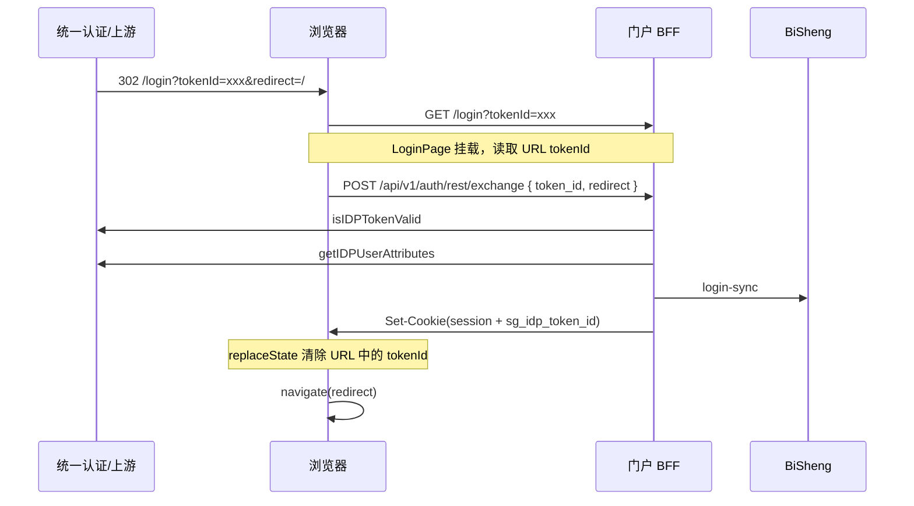
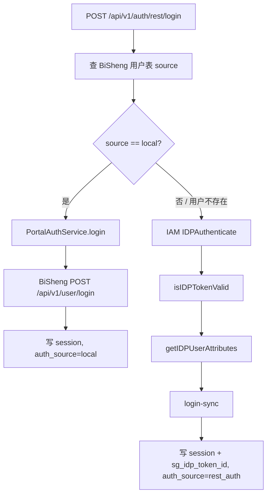

# 统一认证 REST 登录挂接方案

> **文档版本**：v1.3  
> **日期**：2026-07-23  
> **变更**：v1.1 增加账密登录分流——本地用户走门户/BiSheng 密码校验，非本地用户走 IAM REST  
> **变更**：v1.2 本地用户判定改为查询 **BiSheng 用户表 `source` 字段**，要求值为 `local`  
> **变更**：v1.3 增加 **REST API 配置 Admin UI** 详细设计（对齐现有 OAuth 统一认证配置页）
> **依据**：[首钢测试环境统一身份认证rest集成指南v1.0.0(1)(1).docx](../../首钢测试环境统一身份认证rest集成指南v1.0.0(1)(1).docx)  
> **关联代码**：`portal_unified_auth_service.py`、`LoginPage.tsx`、`loginRedirect.ts`、`auth.py`

---

## 1. 背景与目标

IAM 提供 REST 用户名密码认证方案，适用于 **WEB 应用使用自有登录页面** 的场景。门户需在保留现有 OAuth 统一认证能力的前提下，新增 REST 模式挂接。

### 1.1 目标

| 目标 | 说明 |
|------|------|
| 独立登录页 | 用户在门户 `/login` 完成认证，不跳转 IAM OAuth 授权页 |
| tokenId 来自 URL | SSO 入口由上游/IAM 重定向至 `/login?tokenId=...`，门户从 URL 读取 |
| 登录时效由 REST 管控 | 通过 `isIDPTokenValid` 校验 `tokenId` 有效性 |
| REST 独立配置 | 集团环境 `base_url`、`appId` 等与 OAuth 配置分离 |
| 复用 BiSheng 链路 | IAM 用户信息 → `login-sync` → 门户 session cookie |
| 混合账密登录 | 登录页统一表单；**BiSheng `source=local`** 走本地密码，否则走 IAM REST |

### 1.2 明确约束（本方案边界）

| 项 | 决策 |
|----|------|
| tokenId 来源 | **URL 查询参数**（SSO 主路径）；账密登录时 tokenId 来自 `IDPAuthenticate` 响应体，仅在 BFF 内部使用 |
| 设置票据接口 | **不实现** |
| 获取 tokenId 辅助接口 | **不实现**，由 URL 参数替代 |
| REST 全局登出 | **不实现**，REST 用户仅走门户 `POST /api/v1/auth/logout` |
| OAuth 方案 | **保留不动**，通过配置切换 `oauth` / `rest` 模式 |
| 本地用户账密 | **BiSheng 用户表 `source=local`** 时走现有 BiSheng 密码登录，不调用 IAM REST |

---

## 2. REST 与 OAuth 对比

| 维度 | OAuth（现有） | REST（本方案） |
|------|--------------|---------------|
| 登录入口 | `/api/v1/auth/unified/start` | `/login` |
| 用户凭证收集 | IAM 授权页 | 门户登录页统一表单（本地/BiSheng 或 IAM REST 分流）或 URL tokenId |
| IAM 票据 | OAuth `access_token` | REST `tokenId` |
| 时效校验 | 登录时 getUserInfo | `isIDPTokenValid`（exchange/login + `/me`） |
| IAM 回调地址 | 需要 `callback` / `logout/callback` | **不需要** OAuth redirect_uri |
| 登出 | GLO 单点登出 | 仅清门户 session + `sg_idp_token_id` |
| 配置 | 统一认证 OAuth 配置 | **新增 REST 独立配置** |

---

## 3. IAM REST 接口

### 3.1 环境地址

| 环境 | Base URL（示例） |
|------|-----------------|
| 股份测试 | `https://10.68.27.111` |
| 集团生产 | `https://gfsso.shougang.com.cn` |
| 集团测试 | Admin 单独配置（如 `https://amdev.shougang.com.cn`） |

> REST Base URL 与 OAuth Base URL **独立配置**，集团/股份各自填写，不共用默认值推导。

### 3.2 接口清单

| 步骤 | 接口 | 方法 | 路径 | 用途 |
|------|------|------|------|------|
| 账密登录 | `IDPAuthenticate` | POST | `/idp/restful/IDPAuthenticate` | 用户名密码换 `tokenId` |
| 校验 | `isIDPTokenValid` | POST | `/idp/restful/isIDPTokenValid` | 校验 `tokenId` 是否有效 |
| 用户信息 | `GetUserAttributes` | GET | `/idp/restful/getIDPUserAttributes` | 拉取用户属性 |

**公共参数**

- `appId`：REST 专用应用标识（**≠ OAuth client_id**）
- `remoteIp`：客户端 IP（BFF 从 `X-Forwarded-For` / `request.client.host` 获取）
- 参数值含 `%`、`&`、中文等需 **UrlEncode**（文档 1.7.1）

**IDPAuthenticate**（`Content-Type: application/x-www-form-urlencoded`）

```
appId, userName, password, authnMethod=UsernamePassword, remoteIp
```

成功响应：

```json
{ "data": { "tokenId": "..." } }
```

**isIDPTokenValid**

```
appId, tokenId, remoteIp
→ { "data": { "isValid": true } }
```

**getIDPUserAttributes**

```
GET ?appId=&tokenId=&remoteIp=&attributeNames=loginName,uid,mail,mobile,displayName
→ { "data": { "tokenId": "...", "attributes": { ... } } }
```

### 3.3 本方案不使用的接口

| 接口 | 原因 |
|------|------|
| 获取 tokenId 辅助接口 | 由 URL 参数 `tokenId` 替代 |
| 设置票据接口 | 方案明确不实现 |

---

## 4. 认证流程

### 4.1 主流程：URL 携带 tokenId（SSO 入口）

IAM 或上游系统将用户重定向到门户：

```
https://{门户域名}/login?tokenId={tokenId}&redirect={urlencode(目标页)}
```



**要点**

- tokenId **只从 URL 读取**，不调用「获取 tokenId」接口。
- exchange 成功后立即 `history.replaceState` 去掉 URL 中的 `tokenId`。
- 不调用「设置票据」接口。

### 4.2 辅流程：登录页账密登录（无 tokenId，混合分流）

URL 无 `tokenId` 时展示**统一登录表单**（账号 + 密码）。用户提交后，BFF **先查 BiSheng 用户表该账号的 `source` 字段**，再选择认证路径：



**本地用户路径（`source == local`）**

```
查 BiSheng 用户：user_name=account → source == "local"
    ↓
复用现有 PortalAuthService.login(account, password, ...)
    ↓
BiSheng /api/v1/user/login 校验密码
    ↓
写 sg_portal_session，auth_source = local
（不写 sg_idp_token_id；/me 不调 IAM）
```

**非本地用户路径（`source != local` 或 BiSheng 无此用户）**

```
source 为空 / sso / unified / 其他值，或 BiSheng 查无此人
    ↓
IAM IDPAuthenticate → tokenId
    ↓
isIDPTokenValid → getIDPUserAttributes → login-sync → 写 session
auth_source = rest_auth，写 sg_idp_token_id
```

账密路径的 IAM tokenId **不回写到 URL**，仅在 BFF 内部流转后写入 httpOnly Cookie。

#### 4.2.1 本地用户判定：BiSheng 用户表 `source` 字段

「本地用户」**不再**维护 Admin 账号名单，而是以 **BiSheng 用户表**为准：

| 条件 | 登录路径 |
|------|----------|
| BiSheng 存在该账号且 **`source == "local"`** | BiSheng 本地密码登录 |
| BiSheng 存在该账号且 **`source != "local"`**（如 `sso`、`unified` 等） | IAM REST |
| BiSheng **查无此人** | IAM REST（统一认证账号可能尚未同步进 BiSheng 用户表） |

**查询方式（BFF 侧）**

登录分流前，门户 BFF 使用 **门户服务账号**（现有 `BishengRuntimeService` 持有的 runtime token）调用 BiSheng 用户查询接口，按 `user_name` / `account` 定位用户并读取 `source` 字段：

```python
async def resolve_bisheng_user_source(account: str) -> str | None:
    """
    返回 BiSheng 用户 source 字段；用户不存在返回 None。
    仅用于 POST /rest/login 服务端分流，不对前端暴露。
    """
    user = await bisheng.lookup_user_by_account(account.strip())
    if not user:
        return None
    return str(user.get("source") or "").strip().casefold() or None


def is_local_bisheng_user(source: str | None) -> bool:
    return source == "local"
```

**BiSheng 查询接口（实现时需与 BiSheng 侧对齐）**

| 项 | 说明 |
|----|------|
| 推荐 | 复用 BiSheng 管理端/内部 **按用户名查用户** API（需返回 `source` 字段） |
| 调用身份 | 门户集成配置中的 **服务账号 token**（`BishengRuntimeService`） |
| 请求示例 | `GET /api/v1/user/get_user_by_name?user_name={account}`（路径以 BiSheng 实际契约为准） |
| 响应示例 | `{ "user_name": "demo", "source": "local", ... }` |

> 若 BiSheng 尚无按账号查询且返回 `source` 的 API，需在 BiSheng 侧补充（或暴露现有用户表查询能力给门户 BFF）。**禁止**门户 BFF 直连 BiSheng 数据库。

**分流伪代码**

```python
source = await resolve_bisheng_user_source(account)
if is_local_bisheng_user(source):
    return await auth_service.login(...)  # source=local
return await rest.authenticate(...)     # IAM REST
```

> **安全**：不在登录前暴露账号是否为本地用户（不提供公开「账号类型查询」API）；仅在 POST 登录时服务端分流。本地/IAM 密码错误对外统一「账号或密码错误」，避免枚举。

#### 4.2.2 与现有 `/api/v1/auth/login` 的关系

REST 模式启用后，登录页账密提交统一走 **`POST /api/v1/auth/rest/login`**（内含分流逻辑）。现有 `POST /api/v1/auth/login` 可保留给非 REST 模式或内部调用；本地分支内部仍调用 `PortalAuthService.login()`，行为与现有一致（含验证码、多端登录冲突 `force_login`）。

### 4.3 登录时效校验

| 时机 | 行为 |
|------|------|
| `POST /rest/exchange` 或 REST 账密分支 | 必须先调 `isIDPTokenValid` |
| `POST /rest/login` 本地用户分支 | 仅 BiSheng 密码校验，**不调 IAM** |
| `GET /api/v1/auth/me`（`auth_source=rest_auth`） | 读 `sg_idp_token_id`，按间隔调 `isIDPTokenValid` |
| `GET /api/v1/auth/me`（`auth_source=local`） | 沿用现有门户 session 过期策略，**不调 IAM** |
| 前端 401 | 跳 `/login?redirect=...`（不带 tokenId） |

BiSheng session 与 IAM tokenId 可能不同步：**REST 用户以 IAM 校验失败为准强制登出**；本地用户仅看门户 session。

---

## 5. REST 独立配置

### 5.1 配置模型（新增 `RestAuthRuntimeConfig`）

与现有 OAuth `UnifiedAuthRuntimeConfig` **分离存储**，Admin 独立编辑。

```yaml
rest_enabled: false                    # REST 模式总开关

rest_base_url: ""                      # 必填，集团/股份各自配置
rest_app_id: ""                        # 必填，REST 专用 appId

rest_authenticate_url: ""              # 空则 {base}/idp/restful/IDPAuthenticate
rest_token_valid_url: ""              # 空则 {base}/idp/restful/isIDPTokenValid
rest_user_attributes_url: ""          # 空则 {base}/idp/restful/getIDPUserAttributes

rest_token_id_param: tokenId           # URL 参数名，默认 tokenId
rest_http_timeout_seconds: 10
rest_token_check_interval_seconds: 300 # /me 校验间隔
rest_verify_tls: true                  # 测试环境可关
bisheng_lookup_required: false         # BiSheng 查 source 失败时是否直接报错

# BiSheng login-sync（可与 OAuth 共用同一 secret）
login_sync_hmac_secret: ""
login_sync_signature_header: X-Signature
```

### 5.2 默认 URL 拼接

```
rest_authenticate_url     = {rest_base_url}/idp/restful/IDPAuthenticate
rest_token_valid_url      = {rest_base_url}/idp/restful/isIDPTokenValid
rest_user_attributes_url  = {rest_base_url}/idp/restful/getIDPUserAttributes
```

### 5.3 配置示例

| 环境 | rest_base_url | rest_app_id |
|------|---------------|-------------|
| 股份测试 | `https://10.68.27.111` | `restful`（文档测试值） |
| 集团测试 | Admin 填写 | 集团 REST 专用 appId |
| 集团生产 | `https://gfsso.shougang.com.cn` | 集团 REST 专用 appId |

### 5.4 Admin UI：REST API 配置（新增）

REST 配置 UI **对齐现有 OAuth「统一认证配置」页**（`AdminPage.tsx` 中 `UnifiedAuthConfigTable` / `UnifiedAuthEditorDialog`），复用同一套表格 + 弹窗编辑模式、表单样式（`formGrid` / `modalCard`）与密钥不回显策略。

#### 5.4.1 入口与布局

**方案：统一认证页内 Tab 切换（推荐）**

在 Admin 侧栏仍保留单一入口 **「统一认证」**（`nav key: unifiedAuth`），页内顶部增加 Tab：

```
[ OAuth 配置 ]   [ REST 配置 ]     ← 新增 Tab，默认展示 REST（若 rest_enabled）
```

| Tab | 组件 | 说明 |
|-----|------|------|
| OAuth 配置 | 现有 `UnifiedAuthConfigTable` | 不变 |
| REST 配置 | 新增 `RestAuthConfigTable` | 本方案新增 |

**互斥提示（页内 Banner）**

OAuth 与 REST **不宜同时作为门户默认登录模式**。REST Tab 顶部展示说明：

> 启用 REST 后，门户登录走 `/login` 独立页面；OAuth 跳转入口将停用。请确保 OAuth 与 REST 不要同时启用。本地用户（BiSheng `source=local`）仍走 BiSheng 密码，无需 IAM REST。

当 `oauth.enabled && rest.enabled` 同时为 true 时，两 Tab 均显示 **黄色警告**：「OAuth 与 REST 均已启用，请仅保留一种登录模式。」

#### 5.4.2 列表页：`RestAuthConfigTable`

**标题**：`统一认证 REST 配置`

**说明文案**（`pageNote`）：

> 这里维护门户后端调用统一身份认证 **REST 接口** 的参数。`appId`、Base URL 与 OAuth 的 `client_id` **独立配置**。`login_sync_hmac_secret` 不回显；留空保存时沿用当前值。本地用户判定读取 BiSheng 用户表 `source=local`，无需在此维护账号名单。

**表格列**：配置项 | 当前值 | 操作（编辑）

| 行 label | 展示内容 | 备注 |
|----------|----------|------|
| 启用状态 | 已启用 / 未启用 | |
| REST Base URL | `rest_base_url` 或「未配置」 | 集团/股份各自填写 |
| REST AppId | `rest_app_id` 或「未配置」 | ≠ OAuth client_id |
| IAM 接口地址 | 三行 meta：Authenticate / TokenValid / UserAttributes | 留空则显示「按 Base URL 自动拼接」 |
| URL tokenId 参数 | `rest_token_id_param`（默认 `tokenId`） | SSO 回调 URL 参数名 |
| 超时与校验 | `http_timeout_seconds` s · 校验间隔 `token_check_interval_seconds` s · TLS `{verify_tls}` | |
| 密钥状态 | `login_sync_hmac_secret` 已配置/未配置 | 与 OAuth 页相同句式 |
| 缺失项（可选行） | 启用但缺字段时红色展示 `missing_fields` | 如 `rest_base_url`、`rest_app_id` |

**操作按钮**：「编辑」/「创建」→ 打开 `RestAuthEditorDialog`。

#### 5.4.3 编辑弹窗：`RestAuthEditorDialog`

**标题**：`编辑统一认证 REST 配置`

**副标题**（`modalNote`）：

> REST AppId 与 Base URL 在 IAM 平台单独注册；接口路径留空时由后端按 `{base}/idp/restful/*` 拼接。login_sync_hmac_secret 需与 BiSheng `sso_sync.gateway_hmac_secret` 一致。

**表单字段**（与 OAuth 弹窗相同栅格布局）：

| 字段 | 控件 | placeholder / hint |
|------|------|-------------------|
| 启用 REST 登录 | select：`未启用` / `启用` | 启用后 `auth_mode=rest` |
| REST Base URL | text（wide） | `https://gfsso.shougang.com.cn` 或测试 `https://10.68.27.111` |
| REST AppId | text | `restful`（测试）或集团生产 appId |
| authenticate_url | text（wide） | 留空 → `{base}/idp/restful/IDPAuthenticate` |
| token_valid_url | text（wide） | 留空 → `{base}/idp/restful/isIDPTokenValid` |
| user_attributes_url | text（wide） | 留空 → `{base}/idp/restful/getIDPUserAttributes` |
| URL tokenId 参数名 | text | 默认 `tokenId` |
| HTTP 超时（秒） | number text | 例如 `10` |
| Token 校验间隔（秒） | number text | 例如 `300`，用于 `/me` |
| 校验 TLS 证书 | select：`是` / `否（测试环境）` | 对应 `rest_verify_tls` |
| login_sync_hmac_secret | password（wide） | 已配置时 placeholder「留空沿用」 |
| 签名请求头 | text | 默认 `X-Signature` |
| BiSheng 查询失败策略 | select | `默认走 IAM REST` / `直接报错`（对应 `rest_bisheng_lookup_required`） |

**底部按钮**：「取消」「保存并验证」（与 OAuth 一致，`saving` 态禁用）

**保存成功**：Toast「REST 配置已保存」并刷新 `RestAuthConfigTable`；关闭弹窗。

#### 5.4.4 前端类型与 API Client

**文件**：`frontend/src/api/adminConfig.ts`

```typescript
export interface RestAuthRuntimeConfig {
  enabled: boolean;
  rest_base_url: string;
  rest_app_id: string;
  authenticate_url: string;
  token_valid_url: string;
  user_attributes_url: string;
  rest_token_id_param: string;
  http_timeout_seconds: number;
  token_check_interval_seconds: number;
  verify_tls: boolean;
  login_sync_signature_header: string;
  bisheng_lookup_required: boolean;
  has_login_sync_hmac_secret: boolean;
  missing_fields: string[];
}

export function fetchRestAuthRuntimeConfig() {
  return request<RestAuthRuntimeConfig>('/api/v1/admin/config/rest-auth');
}

export function updateRestAuthRuntimeConfig(payload: { ... }) {
  return request<RestAuthRuntimeConfig>('/api/v1/admin/config/rest-auth', {
    method: 'POST',
    body: JSON.stringify(payload),
  });
}
```

**Draft 类型**（`AdminPage.tsx`）：

```typescript
interface RestAuthDraft {
  enabled: boolean;
  rest_base_url: string;
  rest_app_id: string;
  authenticate_url: string;
  token_valid_url: string;
  user_attributes_url: string;
  rest_token_id_param: string;
  http_timeout_seconds: string;
  token_check_interval_seconds: string;
  verify_tls: boolean;
  login_sync_hmac_secret: string;
  login_sync_signature_header: string;
  bisheng_lookup_required: boolean;
}
```

#### 5.4.5 表单校验：`validateRestAuthDraft`

与 `validateUnifiedAuthDraft` 同级实现：

| 规则 | 错误提示 |
|------|----------|
| `enabled && !rest_base_url` | 启用 REST 前需要填写 REST Base URL |
| `enabled && !rest_app_id` | 启用 REST 前需要填写 REST AppId |
| URL 字段非空时必须 `http(s)://` 开头 | `{field} 必须以 http:// 或 https:// 开头` |
| `http_timeout_seconds` > 0 | HTTP 超时需为大于 0 的数字秒 |
| `token_check_interval_seconds` > 0 | Token 校验间隔需为大于 0 的整数秒 |
| 首次启用且无历史 secret 且 secret 为空 | 首次启用 REST 需要填写 login_sync_hmac_secret |
| `rest_token_id_param` 非空且符合参数名 | 仅允许字母数字下划线，默认回退 `tokenId` |

#### 5.4.6 Admin BFF API

**文件**：`backend/app/api/routes/admin_config.py`（与 OAuth 并列）

| 方法 | 路径 | 说明 |
|------|------|------|
| GET | `/api/v1/admin/config/rest-auth` | 返回 `RestAuthRuntimeConfigView`（无 secret 明文） |
| POST | `/api/v1/admin/config/rest-auth` | 更新配置，secret 留空则沿用 |

**存储**：`portal_admin_config_store` 增加 document key `rest_auth_runtime_config`（与 `unified_auth_runtime_config` 分离）。

**View 响应示例**：

```json
{
  "enabled": true,
  "rest_base_url": "https://gfsso.shougang.com.cn",
  "rest_app_id": "portal-rest-prod",
  "authenticate_url": "",
  "token_valid_url": "",
  "user_attributes_url": "",
  "rest_token_id_param": "tokenId",
  "http_timeout_seconds": 10,
  "token_check_interval_seconds": 300,
  "verify_tls": true,
  "login_sync_signature_header": "X-Signature",
  "bisheng_lookup_required": false,
  "has_login_sync_hmac_secret": true,
  "missing_fields": []
}
```

#### 5.4.7 AdminPage 状态与加载

与 OAuth 配置对称增加：

```typescript
const [restAuthConfig, setRestAuthConfig] = useState<RestAuthRuntimeConfig | null>(null);
const [restAuthEditorOpen, setRestAuthEditorOpen] = useState(false);
const [restAuthDraft, setRestAuthDraft] = useState<RestAuthDraft>(createRestAuthDraft());
const [restAuthFormError, setRestAuthFormError] = useState('');
const [unifiedAuthTab, setUnifiedAuthTab] = useState<'oauth' | 'rest'>('rest');
```

`loadAdminConfig()` 中 `Promise.allSettled` 增加 `fetchRestAuthRuntimeConfig()`。

#### 5.4.8 UI 线框（ASCII）

```
┌─ 统一认证 ─────────────────────────────────────────────┐
│  [ OAuth 配置 ]  [ REST 配置* ]                          │
│  ⚠ OAuth 与 REST 不宜同时启用（若双开则显示）              │
├──────────────────────────────────────────────────────────┤
│  统一认证 REST 配置                                       │
│  说明：维护 IAM REST 接口参数…                            │
│                                                          │
│  ┌──────────────┬─────────────────────────┬──────────┐ │
│  │ 配置项        │ 当前值                   │ 操作     │ │
│  ├──────────────┼─────────────────────────┼──────────┤ │
│  │ 启用状态      │ 已启用                   │ [编辑]   │ │
│  │ REST Base URL│ https://10.68.27.111     │ [编辑]   │ │
│  │ REST AppId   │ restful                  │ [编辑]   │ │
│  │ IAM 接口     │ 自动拼接 /idp/restful/…  │ [编辑]   │ │
│  │ …            │ …                        │ …        │ │
│  └──────────────┴─────────────────────────┴──────────┘ │
└──────────────────────────────────────────────────────────┘

        [ 编辑 ] →  RestAuthEditorDialog（modal）
```

#### 5.4.9 测试

**文件**：`frontend/tests/adminRestAuthConfig.test.ts`

- `fetchRestAuthRuntimeConfig` / `updateRestAuthRuntimeConfig` 路径正确
- `validateRestAuthDraft` 必填项与 URL 校验
- `AdminPage.tsx` 含 `RestAuthConfigTable`、`RestAuthEditorDialog`、`fetchRestAuthRuntimeConfig`
- 响应 JSON 不含 `login_sync_hmac_secret` 明文

> 本地用户判定依赖 BiSheng 用户表 `source` 字段，**REST 配置 UI 不提供本地账号名单编辑**。

### 5.5 公开配置（前端判断登录模式）

```json
GET /api/v1/auth/unified/config
{
  "enabled": true,
  "auth_mode": "rest",
  "rest_token_id_param": "tokenId",
  "label": "统一身份认证"
}
```

`auth_mode` 取值：`oauth` | `rest` | `none`。

---

## 6. 门户需暴露的地址

### 6.1 IAM / 上游需重定向的地址

REST 模式**不需要**注册 OAuth `redirect_uri` 或 GLO callback。

SSO 入口：

```
https://{门户域名}/login?tokenId={tokenId}&redirect={urlencode(目标页)}
```

示例：

```
https://10.171.0.30:30335/login?tokenId=MTkyLjE2OC4xNzQuMTI5...&redirect=%2F
```

### 6.2 门户新增 BFF API

| 方法 | 路径 | 说明 |
|------|------|------|
| POST | `/api/v1/auth/rest/exchange` | URL tokenId 换门户 session（主入口） |
| POST | `/api/v1/auth/rest/login` | 登录页账密登录（**本地/BiSheng 与 IAM REST 分流**） |
| GET | `/api/v1/auth/rest/config` | 公开 REST 配置（或合并进 unified/config） |

### 6.3 登出（复用现有）

REST 用户统一：

```
POST /api/v1/auth/logout
```

清 `sg_portal_session`、`sg_idp_token_id`、`sg_portal_auth_source`，**不调用 IAM 全局登出**。

---

## 7. 后端设计

### 7.1 新增模块

```
backend/app/schemas/rest_auth_runtime.py
backend/app/services/rest_auth_runtime_service.py
backend/app/services/portal_rest_auth_service.py
backend/app/services/portal_bisheng_user_lookup.py   # 按账号查 source
backend/tests/test_auth_rest_api.py
```

### 7.2 POST `/api/v1/auth/rest/exchange`

**请求**

```json
{
  "token_id": "MTkyLjE2OC4xNzQuMTI5...",
  "redirect": "/"
}
```

**处理流程**

1. `isIDPTokenValid(appId, tokenId, remoteIp)`
2. `getIDPUserAttributes(appId, tokenId, remoteIp)`
3. `map_rest_user_attributes()` → `MappedUnifiedUser`
4. 复用 `portal_unified_auth_service._login_sync()`
5. `create_session_from_access_token(auth_source="rest_auth")`
6. 写 cookie：`sg_portal_session`、`sg_idp_token_id`、`sg_portal_auth_source=rest_auth`

**错误映射**

| 情况 | 处理 |
|------|------|
| `isValid: false` | `/login?auth_error=token_expired&redirect=...` |
| login-sync 19319 | `portal_auth_notice=user_unregistered`（复用现有弹窗） |
| `invalid_appId` | 日志告警 + `rest_unavailable` |

### 7.3 POST `/api/v1/auth/rest/login`（混合账密）

**请求**

```json
{
  "account": "liuy005x",
  "password": "***",
  "remember": true,
  "redirect": "/",
  "force_login": false,
  "captcha_key": "",
  "captcha": ""
}
```

**处理流程（分流）**

```python
async def rest_login(account, password, ...):
    normalized = normalize_account(account)
    config = rest_auth_service.resolve_config()

    source = await bisheng_user_lookup.resolve_user_source(normalized)
    if is_local_bisheng_user(source):
        # source == "local"：BiSheng 本地密码登录
        session = await auth_service.login(
            account=normalized,
            password=password,
            remember=remember,
            captcha_key=captcha_key,
            captcha=captcha,
            force_login=force_login,
        )
        return attach_local_session(session, auth_source="local")

    # source != local 或用户不存在：IAM REST
    token_id = await rest.authenticate(config.app_id, normalized, password, client_ip)
    return await complete_rest_session(token_id, redirect, remember)  # 同 exchange
```

**`is_local_bisheng_user` 实现要点**

```python
def is_local_bisheng_user(source: str | None) -> bool:
    return (source or "").strip().casefold() == "local"
```

**BiSheng 查询失败策略**

| 情况 | 处理 |
|------|------|
| 用户存在且 `source=local` | 走 BiSheng 密码登录 |
| 用户存在且 `source!=local` | 走 IAM REST |
| 用户不存在 | 走 IAM REST |
| BiSheng 查询接口超时/5xx | 记录告警；**默认走 IAM REST**（避免阻断仅 IAM 账号登录）；可配置 `rest_bisheng_lookup_required=true` 时直接返回「登录服务暂不可用」 |

**错误映射（补充）**

| 情况 | 处理 |
|------|------|
| `source=local` 且密码错误 | 「账号或密码错误」（与现有 `loginPortal` 一致） |
| `source=local` 多端冲突 | 复用 `10612` 确认弹窗 + `force_login` |
| 非本地 IAM 认证失败 | 「账号或密码错误」或 IAM 细分文案（密码过期等） |
| 非本地 login-sync 19319 | `portal_auth_notice=user_unregistered` |
| BiSheng 查用户失败 | 见上表「BiSheng 查询失败策略」 |

### 7.4 用户属性映射

REST 返回 `data.attributes`，复用现有 `map_unified_userinfo` 逻辑：

```python
def map_rest_user_attributes(payload: dict) -> MappedUnifiedUser:
    attrs = payload.get("data", {}).get("attributes", {})
    return map_unified_userinfo({"data": {"attributes": attrs}}, {})
```

关键字段：`loginName`、`uid`、`mail`、`mobile`、`displayName`（见 `portal_unified_auth_service.py`）。

### 7.5 `/me` 时效扩展

按 `auth_source` 分支：

```python
auth_source = session.auth_source  # local | rest_auth | unified_auth | ...

if auth_source == "rest_auth":
    token_id = request.cookies.get("sg_idp_token_id")
    if not token_id or not await rest.is_token_valid(app_id, token_id, client_ip):
        clear_session + clear sg_idp_token_id
        raise PortalAuthError("统一认证已过期，请重新登录", 401)

if auth_source == "local":
    # 仅现有 session.expires_at / BiSheng token 校验，不调 IAM
    pass
```

### 7.6 与现有 OAuth 代码关系

| 现有模块 | REST 用法 |
|----------|----------|
| `BishengRuntimeService` | 提供服务账号 token，供 **按账号查用户 `source`** |
| `PortalAuthService.login` | **`source=local`** 分支直接复用（BiSheng 密码校验） |
| `_login_sync` | 非本地用户分支复用或抽取为 `PortalSsoSyncService` |
| `_map_login_sync_failure` | 直接复用 |
| `create_session_from_access_token` | 复用，`auth_source="rest_auth"` |
| `PortalAuthNoticeHost` | 复用未注册用户弹窗 |
| OAuth `build_start` / `callback` | REST 模式下不调用 |
| GLO 单点登出 | REST 模式不调用 |

---

## 8. 前端设计

### 8.1 登录页 `/login`（复用 `LoginPage.tsx`）

```typescript
const params = new URLSearchParams(location.search);
const tokenId = params.get(config.rest_token_id_param ?? 'tokenId');
const redirect = normalizePortalRedirect(params.get('redirect'));

if (tokenId) {
  await restExchange({ token_id: tokenId, redirect });
  params.delete(config.rest_token_id_param ?? 'tokenId');
  navigate({ pathname: '/login', search: params.toString() }, { replace: true });
  navigate(redirect, { replace: true });
  return;
}

// 无 tokenId → 展示统一账密表单（提交走 rest/login，后端分流本地/IAM）
// REST 模式隐藏 OAuth 跳转按钮

async function handlePasswordLogin() {
  await restLogin({
    account,
    password,
    remember,
    redirect,
    force_login: forceLogin,
    captcha_key: captchaKey,
    captcha,
  });
}
```

### 8.2 登录跳转（`loginRedirect.ts`）

```typescript
if (config.auth_mode === 'rest') {
  window.location.assign(buildLocalLoginPath(returnTo));
  return;
}
if (config.auth_mode === 'oauth') {
  startPortalLogin(returnTo);
  return;
}
```

### 8.3 登出（`useAuth.ts`）

```typescript
const authSource = getAuthSource(); // 来自 cookie 或 session 元数据

if (authSource === 'rest_auth') {
  await logoutPortal();
  clearPortalUser();
  window.location.assign('/login');
  return;
}
if (authSource === 'local') {
  await logoutPortal();  // 仅清门户 session，不调 IAM
  clearPortalUser();
  window.location.assign('/login');
  return;
}
// OAuth 继续 buildPortalLogoutStartUrl() → GLO
```

登录页 UI **不区分**本地/统一认证用户，同一表单；分流完全在后端完成。

---

## 9. Cookie 设计

| Cookie | 写入时机 | 登出清除 | 用途 |
|--------|----------|----------|------|
| `sg_portal_session` | 任意登录成功 | ✓ | BiSheng 业务 API |
| `sg_idp_token_id` | REST 账密 / exchange 成功 | ✓ | IAM tokenId；**本地用户不写** |
| `sg_portal_auth_source` | 登录成功 | ✓ | `local` / `rest_auth` / `unified_auth`，区分 `/me` 与登出 |

属性：`httpOnly`、`Secure`（生产）、`SameSite=Lax`。

---

## 10. 安全要求

1. **密码、tokenId 不落库、不写日志**（扩展现有 `_redact_sensitive`）。
2. **appId 不暴露前端**，仅 BFF 持有。
3. **浏览器不直连 IAM**，所有 REST 调用经 BFF。
4. **URL tokenId 用后即清**，避免 Referer 泄露。
5. **`/rest/login` 限流**（如 IP 5 次/分钟）。
6. **不泄露账号类型**：本地/IAM 分流结果不对前端暴露；BiSheng `source` 查询仅服务端使用。
7. **TLS 校验可配置**（测试环境证书问题参考 OAuth `verify_tls=False`）。

---

## 11. 实施计划

### Phase 1 — 可联调

- [ ] REST 独立配置 Schema + **Admin REST 配置 UI**（`RestAuthConfigTable` / `RestAuthEditorDialog`）
- [ ] Admin API：`GET/POST /api/v1/admin/config/rest-auth`
- [ ] `portal_rest_auth_service`：三 IAM 接口封装
- [ ] `POST /rest/exchange`
- [ ] `LoginPage` URL tokenId 检测 + exchange + 清参
- [ ] 复用 login-sync + 未注册弹窗

### Phase 2 — 完整登录

- [ ] `POST /rest/login`（账密 + **BiSheng `source` 分流**）
- [ ] `portal_bisheng_user_lookup`：按账号查用户 `source`
- [ ] 与 BiSheng 对齐用户查询 API 契约
- [ ] `loginRedirect.ts` REST 模式跳 `/login`
- [ ] REST / 本地登出走 `POST /logout` only

### Phase 3 — 时效与测试

- [ ] `/me` 集成 `isIDPTokenValid`
- [ ] `test_auth_rest_api.py`
- [ ] 链路日志（`log_unified_auth_trace` 扩展 `auth_mode=rest`）

---

## 12. 联调检查清单

1. Admin **REST 配置 Tab** 填写 `rest_base_url` + `rest_app_id`，启用 REST 并保存。
2. Admin 保存后 GET `/api/v1/admin/config/rest-auth` 不回显 secret。
2. IAM 重定向：`/login?tokenId=xxx&redirect=/`。
3. exchange 成功 → 进首页，URL 无 tokenId。
4. token 过期或 cookie 篡改 → `/me` 401 → 跳登录页。
5. 点击退出 → 仅清门户 cookie，回 `/login`，不跳 IAM。
6. 用户不在 BiSheng 用户表 → 弹窗「您未在本系统注册，请联系管理员」。
7. **BiSheng `source=local` 用户** → BiSheng 密码校验，成功登录，`auth_source=local`，无 IAM 调用。
8. **BiSheng `source!=local` 或不存在用户** → IAM REST 三步 + login-sync，`auth_source=rest_auth`。

---

## 13. 代码改动清单

| 层级 | 文件 | 改动 |
|------|------|------|
| Schema | `backend/app/schemas/rest_auth_runtime.py` | 新增 |
| Service | `backend/app/services/rest_auth_runtime_service.py` | 新增 |
| Route | `backend/app/api/routes/admin_config.py` | `GET/POST /rest-auth` |
| Store | `portal_admin_config_store.py` | `rest_auth_runtime_config` document |
| Service | `backend/app/services/portal_rest_auth_service.py` | 新增 |
| Service | `portal_bisheng_user_lookup.py` | 按账号查 BiSheng `source` |
| Service | `bisheng_runtime_service.py` | 服务账号 token 查用户 |
| Service | `portal_unified_auth_service.py` | 抽取 `_login_sync` 供复用 |
| Service | `portal_auth_service.py` | REST `/me` 校验；本地分支复用 `login()` |
| Route | `backend/app/api/routes/auth.py` | 新增 REST 登录路由 |
| Frontend | `api/adminConfig.ts` | `RestAuthRuntimeConfig` + fetch/update |
| Frontend | `AdminPage.tsx` | Tab + `RestAuthConfigTable` + `RestAuthEditorDialog` + `validateRestAuthDraft` |
| Frontend | `LoginPage.tsx` | URL tokenId + `restLogin` |
| Frontend | `loginRedirect.ts` | `auth_mode=rest` |
| Frontend | `useAuth.ts` | REST 门户登出 |
| Frontend | `api/auth.ts` | REST client |
| Test | `backend/tests/test_rest_auth_runtime_service.py` | Admin REST 配置 API |
| Test | `frontend/tests/adminRestAuthConfig.test.ts` | UI 与表单校验 |
| Test | `backend/tests/test_auth_rest_api.py` | REST 登录链路 |

---

## 14. 明确不做

| 项 | 原因 |
|----|------|
| 获取 tokenId 辅助接口 | URL 参数替代 |
| 设置票据接口 | 方案边界 |
| IAM 全局登出 / GLO（REST 模式） | 仅门户登出 |
| OAuth client_id 复用为 REST appId | 独立 REST 配置 |
| IAM OAuth callback（REST 模式） | REST 不走 OAuth 流程 |
| Admin 维护本地用户名单 | 改查 BiSheng 用户表 `source=local` |
